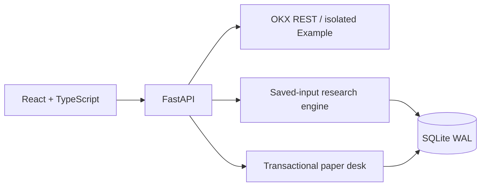

# Tidebench

**Evidence before execution.**

An inspectable crypto research and paper-trading workspace, starting with OKX public market data.

[](https://github.com/billpwchan/tidebench/actions/workflows/ci.yml)
[](LICENSE)
[](pyproject.toml)
[](frontend/package.json)

English · [简体中文](README.zh-CN.md) · [Quick start](#quick-start) · [Architecture](docs/architecture.md) · [Contributing](CONTRIBUTING.md)


**Developer preview · spot only · local paper execution.** Tidebench reads real OKX data through REST polling. Its simulated orders stay in a local ledger; they are neither OKX Demo Trading nor live exchange orders. No exchange API key is needed or accepted.

## Why Tidebench

A backtest should come with enough evidence to inspect it: the exact inputs, when information became available, execution assumptions, costs, and the resulting account changes.

Tidebench connects that evidence to an interactive workspace for exploring markets, comparing experiments and following a paper account.

| Question | What you can inspect |
| --- | --- |
| Which data produced this result? | Saved candles, instrument rules, dataset hash and a versioned manifest |
| Can I reproduce it later? | Snapshot replay and a JSON export of the inputs and result |
| When could this trade occur? | Confirmed-close signals, next-open historical fills, explicit fees and slippage |
| What changed in the account? | Decimal balances, average-cost inventory, fills and audit events committed together |
| What can stop new risk? | Order/exposure/loss limits and a persistent halt switch checked inside the fill transaction |
| Can I try it offline? | An explicitly synthetic Example source with its own account and research records |

## Quick start

Install **Python 3.12–3.14**, [uv](https://docs.astral.sh/uv/getting-started/installation/), **Node.js 22.12+**, Git and Make. The Docker build uses Node.js 24.

```bash
git clone https://github.com/billpwchan/tidebench.git
cd tidebench
make setup
make dev
```

Open **[localhost:5173](http://localhost:5173)**. `make dev` starts the API and Vite together; stop them with Ctrl+C.

Choose **Example** in the source selector for an offline walkthrough. It generates deterministic synthetic prices with a fixed clock; it is separate from OKX data and does not advance as a live feed.

1. Explore a market and open Research.
2. Run a strategy with explicit fee, slippage and allocation settings.
3. Inspect the equity curve, fills and manifest; export or replay the saved snapshot.
4. Submit a local paper order, review its account changes, then test a risk limit or halt.

Selecting **OKX** requires access to the configured regional public endpoints. Connection failures remain visible; Tidebench does not silently substitute Example data.

### Serve the built workspace locally

```bash
make build
uv run python -m tidebench
```

Open **[localhost:8000](http://localhost:8000)**. One Python process serves the built frontend, API and supervisors. Data persists in `./data`; use one process and one worker per database.

### Docker

Prepare a workspace token locally:

```bash
cp .env.example .env
python3 -c "import secrets; print(secrets.token_urlsafe(32))"
```

Put the generated value in `TIDEBENCH_API_TOKEN` in `.env` before continuing. Use at least 32 random characters and keep `.env` private.

```bash
docker compose up --build
```

Open **[localhost:8080](http://localhost:8080)** and enter that **workspace token** in Settings. This token protects Tidebench; it is separate from an exchange API key. Compose stores account and research data in a named volume.

The container CI job builds the image and smoke-tests its health endpoint and authenticated synthetic-data API. See the linked workflow for the actual result; this is not an operational-readiness assessment.

### Regional data endpoints

Set `TIDEBENCH_REGION` to `global` (default), `us`, or `eea` in your environment or `.env`:

```bash
TIDEBENCH_REGION=us make dev
```

Instrument availability varies by region. See [OKX integration and data terms](docs/okx-integration.md).

## What ships in v0.1

| Area | Implemented scope |
| --- | --- |
| Markets | BTC-USDT, ETH-USDT, SOL-USDT, OKB-USDT, DOGE-USDT; subject to regional availability |
| Bars | `15m`, `1H`, `4H`, `1Dutc` |
| Strategies | SMA crossover, Wilder RSI reversion, buy and hold |
| Research | 60–2,000 confirmed bars, saved inputs, quality validation, cost assumptions, benchmark, export and replay |
| Paper desk | Manual orders and strategy supervision; persistent, separate OKX-sourced and Example accounts |
| Controls | Durable idempotency, cash/inventory checks, order and position limits, observed-day loss guard, halt, audit log |
| Interface | Market charts, research, paper inventory, risk and workspace settings |

Historical research fills at the next bar's open. Forward paper strategies use an observed bid/ask after the signal closes, plus polling delay, tick rounding and simulated costs. Their fills and PnL can differ. Paper fills use a **10 bps fee and 5 bps adverse slippage**; historical research exposes both as parameters.

## Architecture



The backend is a modular monolith with a pure Python/Decimal engine and bounded background work. The frontend uses Vite, TanStack Query and Lightweight Charts. SQLite transactions serialize account mutations; a process lease enforces the single-instance boundary.

Read the [architecture](docs/architecture.md), [API contract](docs/api-contract.md) and [engine contract](docs/research-engine.md) for the precise behavior. The [trader product specification](docs/trader-product-spec.zh-CN.md) and [independent architecture challenge](docs/architecture-review.md) describe the commercial target and the failures its design must withstand.

<details>
<summary>Research workspace: assumptions, benchmark, fills and replay</summary>


</details>

## Verification

```bash
make check
cd frontend && npx playwright install chromium && cd ..
make browser-test
```

The checks cover Python lint/formatting, engine and backend tests, and the frontend build; browser tests exercise user workflows. Tests include future-data perturbation, prefix replay, fee/precision accounting, concurrent command deduplication, rollback, ledger replay, stop races and queue admission limits.

CI status above links to the actual workflow. See the [verification record](docs/verification.md) for observed results and untested boundaries. Test coverage is evidence of specific checks, not a claim of production maturity or profitable strategies.

## Model and deployment limits

- Long-only spot simulation; no shorts, leverage, derivatives or exchange execution.
- Bar data cannot reconstruct intrabar paths, order queues, partial fills or market impact. The benchmark enters with full allocation, which may differ from the strategy's allocation.
- Sharpe remains unavailable with fewer than **30 complete UTC daily returns**, or negligible return variation. Thirty observations do not establish statistical significance.
- Fees are simulated in USDT. Per-asset exchange fee accounting and account reconciliation are future work.
- The daily loss anchor is the pre-fill equity of the **first accepted paper command with complete fresh marks** in that UTC day. It is not a midnight valuation or continuous account-wide stop.
- One workspace, one operator, one process, one SQLite writer. Multi-tenant authorization, distributed execution and availability guarantees are outside this release.
- Example prices have a fixed clock. A deployed Example strategy evaluates the available bar and then waits for new data.

The halt switch blocks all new simulated fills and retains positions. Stopping a strategy also retains positions. Already committed commands remain retrievable through their idempotency keys.

## Roadmap

| Available now | Planned, subject to explicit readiness gates |
| --- | --- |
| Validated OKX REST data and isolated synthetic examples | WebSocket ingestion with reconnect and gap recovery |
| Saved-input bar research and replay | Larger datasets, walk-forward evaluation and research catalogs |
| Transactional local spot paper ledger | Exchange demo adapter with reconciliation and partial-fill handling |
| Single-workspace access and risk controls | PostgreSQL, worker fencing, observability and tested recovery |
| Local interactive workspace | User research, accessibility review and broader workflow validation |

Private exchange execution requires its own reviewed design and acceptance evidence. See the [commercial readiness gates](docs/commercial-readiness.md).

## Documentation and contributions

- [Product plan / 产品方案](docs/product-plan.zh-CN.md)
- [Trader workflows and commercial target / 交易员产品规格](docs/trader-product-spec.zh-CN.md)
- [Architecture challenge and failure scenarios](docs/architecture-review.md)
- [Architecture and risk semantics](docs/architecture.md)
- [Research engine and metric assumptions](docs/research-engine.md)
- [OKX data integration and licensing](docs/okx-integration.md)
- [Commercial readiness gates](docs/commercial-readiness.md)
- [Launch notes](docs/launch.md)

Reviews of causal replay, accounting invariants, data quality and usability are especially useful. Read [CONTRIBUTING.md](CONTRIBUTING.md), open an [issue](https://github.com/billpwchan/tidebench/issues), or propose a focused pull request with a reproducible example. Report security issues through [SECURITY.md](SECURITY.md).

## License and data rights

Original application code is available under the [MIT License](LICENSE). That license does not grant rights to exchange market data, services or trademarks. No real OKX historical dataset is bundled. Locally fetched data and exports remain subject to the provider's terms; hosted or commercial redistribution needs a separate assessment. See [data rights](docs/okx-integration.md#data-rights-and-commercial-scope).
