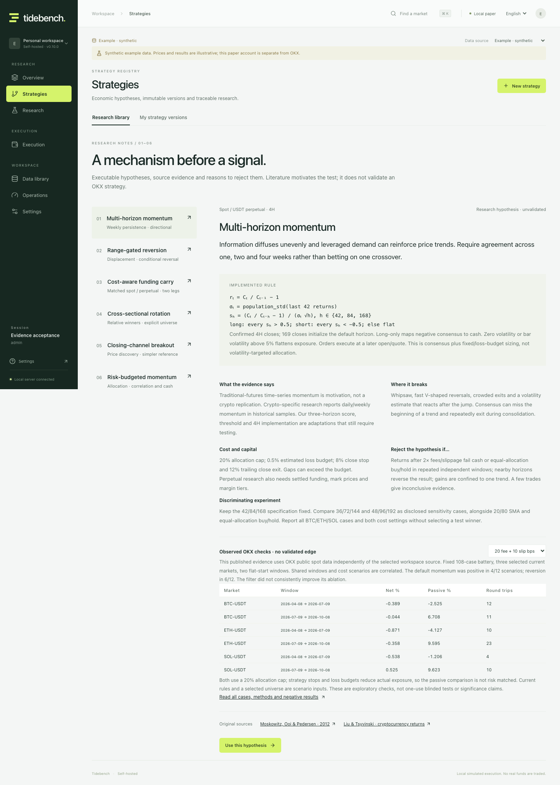
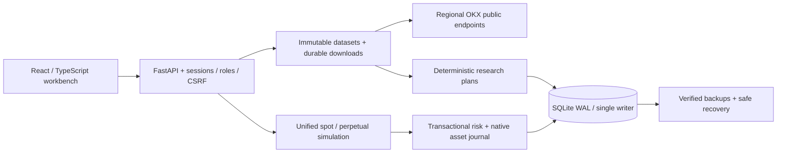
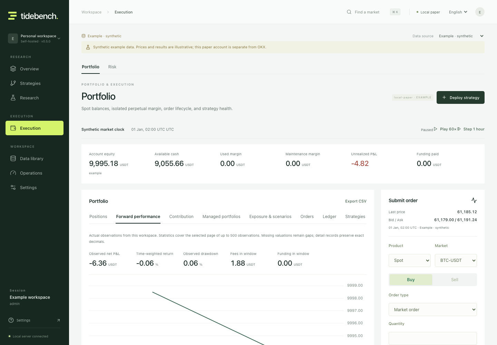
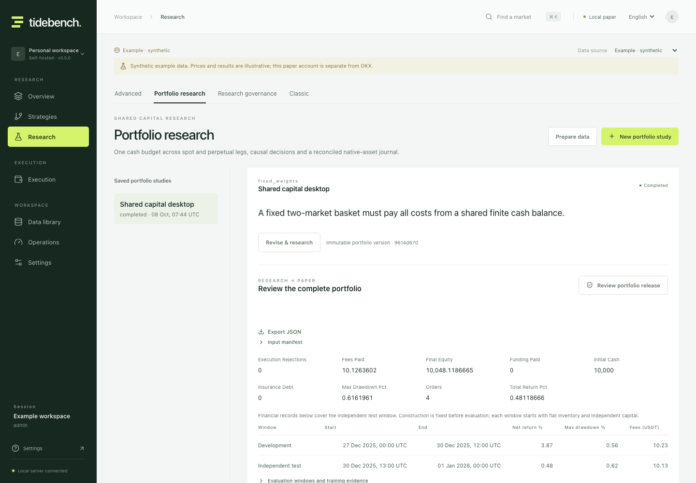
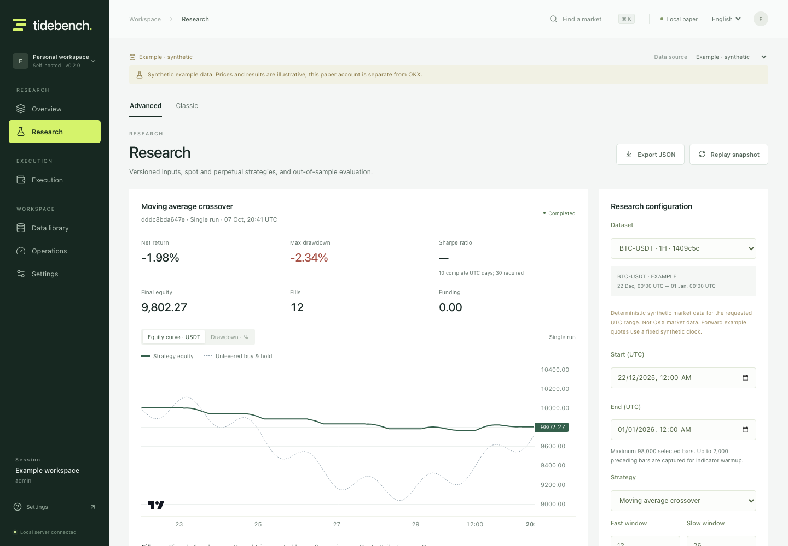
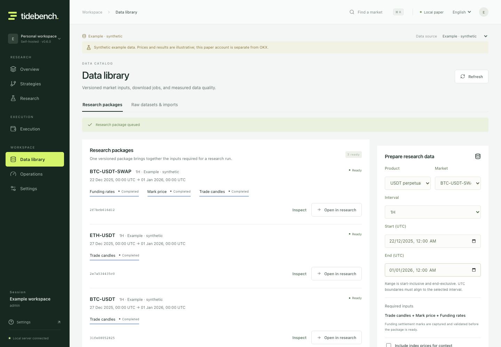
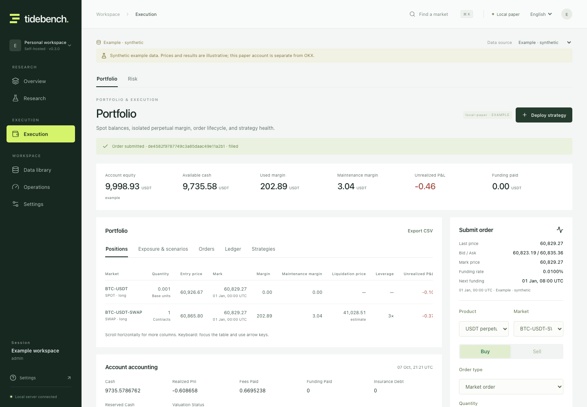
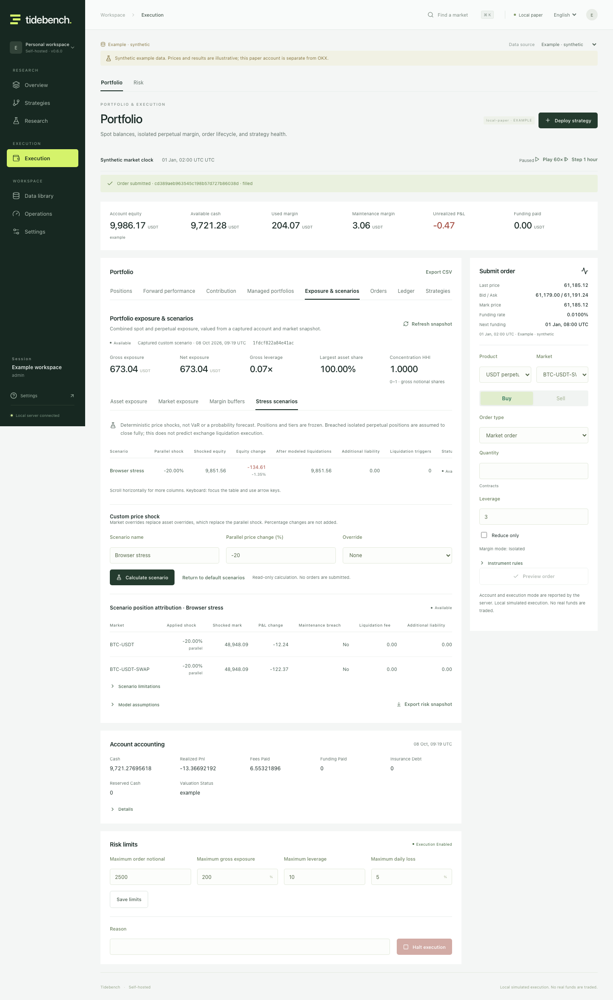

# Tidebench

**Evidence before execution.**

An open-source crypto research and paper trading workbench for OKX spot and linear USDT perpetuals. Version a hypothesis, study a shared-capital portfolio, review its deployment, and trace actual simulated fills through the account and contribution ledgers.

[](https://github.com/billpwchan/tidebench/actions/workflows/ci.yml)
[](LICENSE)
[](pyproject.toml)
[](frontend/package.json)

English · [简体中文](README.zh-CN.md) · [Quick start](#quick-start) · [Research model](docs/pro-research.md) · [Operations](docs/operations.md)


Instrument evidence preserves full forward REST data-array observations, including unavailable preopen rows. Compare responses, inspect missing rules, review information known by a UTC time and export exact hashes; older listing timestamps do not manufacture historical coverage. [Observation and recovery guide](docs/instrument-evidence.md).

## A trading desk with evidence you can inspect

Account capital promises, settlement-time funding obligations, shared group failure contracts, current economic incidents and frozen whole-window forward reports connect research to the actual paper account. Post-fill fees and spread losses count at admission; a stopped controller does not erase inventory. Attributed lifecycle events and immutable public order-book cost reports make data limitations inspectable. [Professional workflows](docs/professional-workflows-v0.10.md) · [Historical lifecycle](docs/historical-lifecycle.md) · [Forward evidence](docs/forward-evidence.md) · [Independent reviews](docs/audit/README.md).


New portfolio studies can explicitly choose bounded smaller continuations after shared-account allowance drift, with immutable original orders and unchanged hard guards. Existing frozen-order versions keep their recorded behavior. [Execution policy choices](docs/portfolio-execution-contracts.md).

## Strategies with evidence, including failed hypotheses

The bilingual research library covers weekly momentum, conditional reversion, matched funding carry, relative-strength rotation and closing-channel breakouts. Two new causal signal models and cost-aware carry admissions are executable through the same backtest and persistent paper workflow. Each dossier explains the mechanism, exact formula, sources, costs and what would reject it.

The [public 108-case OKX battery](docs/strategy-research.md) includes all neighbors, cost stress and filter ablations. Default momentum was positive in 4/12 correlated scenarios; reversion in 6/12. The filter did not consistently help. These are disclosed exploratory results, not a profitable-strategy claim. Captured replay matched every input/result hash.



### Position sizing has its own hypothesis

[Risk-budgeted momentum](docs/portfolio-risk-research.md) adds capped inverse-volatility weights, causal covariance, correlation stress and cash allocation to the shared-capital research → reviewed paper workflow. Inspect every decision's risk inputs and contributions; compare planned sleeve risk with actual account volatility and turnover.

All **28 two-year OKX checks** are published. Lower drawdowns came with less exposure; doubled-cost check B returned only **0.17%**, and a neighboring window lost money. The report keeps that counterevidence visible.


## A connected trading workflow

Go from an economic hypothesis to an immutable strategy or portfolio version, reproducible research, reviewed paper release and inspectable forward decisions. Multi-market groups preserve targets and commands across interruption, expose failed-leg compensation, and reconcile actual monetary contribution to the shared account. See [strategy workflows](docs/strategy-workflows.md), [managed portfolios](docs/managed-portfolios.md) and the [self-audit](docs/audit/README.md).

| Workspace | What you can do |
|---|---|
| Overview | Monitor actual positions, pending orders, asset exposure, risk attention and active research from one desk |
| Markets | Inspect confirmed candles and timestamped OKX quotes; switch explicitly to an isolated synthetic source |
| Data library | Prepare a complete research package in one action: trade, mark, settled funding and exact-time settlement marks; inspect blockers, immutable versions and hashes; import attributed history |
| Strategies | Immutable hypotheses and definitions; seven signal families, source-backed dossiers, public contrary evidence, bounded declarative programs, exits, loss budgets and editable research recipes |
| Research | Version-bound replay, grids, cost stress, train/test, walk-forward; single-strategy and captured-input portfolio final evaluations, shared one-use governance and retained trial ledger |
| Portfolio research | Immutable multi-market hypotheses; one cash budget across 2–10 markets, attributed historical membership and distinct listing windows; fixed weights, independent signals, momentum and funding carry; editable hypotheses with rejection criteria and chronological tests |
| Managed portfolios | Whole-group review and activation; durable account promises, targets/commands, common cash scaling, residual limits, group stops and recoverable failed-leg compensation |
| Contributions | Actual owner quantities, entry cost, P&L, fees and funding reconciled to the account; linked fill/event evidence and exports |
| Portfolio | Spot inventory and isolated perpetual positions in one account; order previews, market/limit/stop simulation, reservations, cancellation, leverage, margin and funding |
| Risk | Asset and market gross/net exposure, concentration, isolated margin buffers and captured custom price shocks; transactional limits and a persistent halt |
| Operations | Named users and roles, sessions, audit, feed age, progress health, disposable research processes, persistent incidents, verified backups and recovery |

The research engine makes time, costs and accounting visible. Signals use confirmed closes; historical fills occur at the next open. Walk-forward candidates are selected on training data only. Test folds start with independent accounts; the UI does not invent a continuous equity curve from overlapping experiments.

Perpetual research uses separate mark prices, actual settled funding rates, contract multipliers and captured maintenance tiers. It exposes historical bar approximations and the use of current tiers as a scenario assumption. A liquidation gap becomes an explicit liability and pauses new simulated risk; it does not disappear from P&L.

**Execution is local simulation.** Tidebench reads real public market data but sends no exchange orders. No exchange API key is needed or accepted. This is the execution scope of this product, including its Docker deployment.

## Quick start

Requires Python 3.12–3.14, [uv](https://docs.astral.sh/uv/getting-started/installation/), Node.js 22.12+ and Make.

```bash
git clone https://github.com/billpwchan/tidebench.git
cd tidebench
make setup
make dev
```

Open [localhost:5173](http://localhost:5173) and create your administrator. Passwords have a 12-character minimum; sessions use HTTP-only cookies. No default account is shipped.

For an offline walkthrough, choose **Example**:

1. Open **Strategies**, load a reference hypothesis or define your own, and save a version. Choose **Research this version**.
2. Open **Data library → Research packages**, choose a spot or perpetual market and UTC range, then **Prepare research package**. A perpetual package gathers trade, mark, realized funding and settlement marks before becoming ready.
3. Prepare and select the exact data version in the bound study. Evaluate costs and independent test windows; export or replay the captured evidence. **Research governance** freezes a one-use final test before evaluation. The portfolio protocol also captures complete inputs, displays fixed cash-benchmark rejection criteria and verifies frozen replay. [Protocol and recovery guide](docs/research-governance.md).
4. **Review paper release** from the result, inspect the selected configuration and current policy, approve and activate. In **Execution**, advance the synthetic clock and inspect actual decisions, orders, exits and observed account performance. Order previews and captured exposure scenarios remain available.
5. For a multi-market workflow, open **Portfolio research**, choose ready aligned packages and save a version-bound study. **Review portfolio release** approves the whole group. In **Execution → Managed portfolios**, inspect targets, cash scale, actual commands and residuals; **Contributions** reconciles its monetary P&L to the account. See the [full guide](docs/managed-portfolios.md).
6. Open **Operations**. Create and verify a backup. A restore replaces workspace state, revokes sessions, cancels pending orders/commands, stops groups and halts accounts.

Example time can be paused, accelerated or stepped forward, with separate capital. OKX failures remain visible; the application never substitutes synthetic prices automatically.


### Built application

```bash
make build
uv run python -m tidebench
```

Open [localhost:8000](http://localhost:8000). One Python process serves the application, API and bounded background workers. Local state lives in `./data`.

### Docker

```bash
cp .env.example .env
python3 -c "import secrets; print(secrets.token_urlsafe(32))"
```

Put the generated value in `TIDEBENCH_BOOTSTRAP_TOKEN` in your private `.env`, then:

```bash
docker compose up --build
```

Open [localhost:8080](http://localhost:8080). Enter that bootstrap token when creating the first administrator. It is needed because the container sees the browser connection through the Docker network. Subsequent logins use your username and password.

For HTTPS hosting, set exact allowed hosts/origins, enable secure cookies and use the [deployment runbook](docs/operations.md). Keep one process and one writer per database. The supplied Compose binding is private to the host.

## Inspect the implementation



| Contract | Read more |
|---|---|
| One-action research packages, funding marks and immutable handoff | [Data packages](docs/data-packages.md) |
| Data identity, pagination, retention and imports | [Data operations](docs/data-operations.md) |
| Exposure, isolated margin and captured stress scenarios | [Portfolio risk](docs/portfolio-risk.md) |
| Strategy recipes, review, holdouts, portfolio models and forward evidence | [Strategy workflows](docs/strategy-workflows.md) |
| Multi-market deployment, failed legs and actual contribution accounting | [Managed portfolios](docs/managed-portfolios.md) |
| Signals, costs, funding, liquidation and OOS selection | [Professional research](docs/pro-research.md) |
| Process boundaries, persistence and precision | [Architecture](docs/architecture.md) |
| Authentication, roles, recovery and deployment | [Operations](docs/operations.md) |
| Actual acceptance evidence | [Verification](docs/verification.md) |
| Public APIs and data rights | [OKX integration](docs/okx-integration.md) |

<details>
<summary>Research and execution workspaces</summary>














</details>

## Verification

```bash
make check
cd frontend && npx playwright install chromium && cd ..
make browser-test
```

Tests exercise causal replay, indicator state, cost sensitivity, train-only selection, margin tiers, funding deduplication, native asset accounting, concurrent idempotency, group stop races, hard-exit command recovery, failed-leg compensation, mixed-owner contribution reconciliation, role/CSRF boundaries and actual backup recovery. Browser acceptance covers the rendered desktop and mobile workflows. The [verification record](docs/verification.md) identifies what was measured and the exact scope of that evidence.

## Model boundaries

- REST polling is suitable for bar research and forward paper workflows; it does not provide tick-level execution or a latency guarantee.
- Market, limit and stop orders use a local full-fill model. Historical bars cannot reconstruct queue position, partial fills, market impact or exact intrabar paths.
- Public settled funding history has limited retention. Older research requires attributed imports with an explicit coverage declaration; missing history blocks derivative research.
- Historical funding marks can be one-minute bar-open approximations. Captured current maintenance tiers are scenario inputs, not historical tier evidence.
- Managed portfolios and monetary contribution attribution are implemented. Captured portfolio holdouts and trial governance share market-time reservations with single strategies; recovery retains newer consumption/exposure/trial facts. Public data and external experiments are not statistically blinded. An explicit current universe does not establish historical listing/delisting coverage or survivorship-free research; see the [temporal evidence design](docs/historical-universe-design.md).
- One shared workspace with role-based users, one process and one SQLite writer. This deployment does not provide distributed failover or tenant isolation.
- A short test run cannot prove months of availability or strategy profitability. Metrics state insufficient-sample and insolvent-account conditions explicitly.

See [scope and acceptance](docs/commercial-readiness.md) for implemented controls and evidence boundaries. Exchange execution is a separate product boundary requiring explicit authorization and a private reconciliation adapter.

## Contribute

Reproducible issues and focused changes to research correctness, accounting, data quality and trader workflows are particularly useful. Read [CONTRIBUTING.md](CONTRIBUTING.md), open an [issue](https://github.com/billpwchan/tidebench/issues), or submit a pull request. Report security findings through [SECURITY.md](SECURITY.md).

## License and data rights

Original application code uses the [MIT License](LICENSE). It grants no rights to exchange data, services or trademarks. No real OKX dataset is bundled. Hosted redistribution and commercial data services must satisfy the applicable provider terms; see [data rights](docs/okx-integration.md#data-rights-and-commercial-scope).
