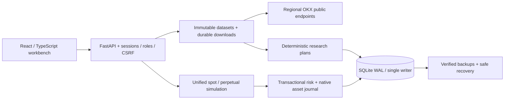

# Tidebench

**Evidence before execution.**

An open-source crypto research and execution workbench for OKX spot and linear USDT perpetuals. Version your market data, test a hypothesis out of sample, and follow every simulated order through the account ledger.

[](https://github.com/billpwchan/tidebench/actions/workflows/ci.yml)
[](LICENSE)
[](pyproject.toml)
[](frontend/package.json)

English · [简体中文](README.zh-CN.md) · [Quick start](#quick-start) · [Research model](docs/pro-research.md) · [Operations](docs/operations.md)


## A connected trading workflow

| Workspace | What you can do |
|---|---|
| Markets | Inspect confirmed candles and timestamped OKX quotes; switch explicitly to an isolated synthetic source |
| Data library | Download trade, mark, index and settled funding history; resume interrupted jobs; inspect gaps, rules, provenance and content hashes; import attributed historical records |
| Research | Single replay, parameter grid, cost stress, train/test and rolling walk-forward evaluation; independent out-of-sample results, fills, funding, liquidations and round trips |
| Portfolio | Spot inventory and isolated perpetual positions in one account; order previews, market/limit/stop simulation, reservations, cancellation, leverage, margin and funding |
| Risk | Transactional order, gross exposure, leverage and observed-day loss limits; a persistent halt that permits reducing exposure |
| Operations | Named users and roles, server-side sessions, audit records, feed age, durable job checkpoints, Prometheus metrics, verified backups and maintenance-mode recovery |

The research engine makes time, costs and accounting visible. Signals use confirmed closes; historical fills occur at the next open. Walk-forward candidates are selected on training data only. Test folds start with independent accounts; the UI does not invent a continuous equity curve from overlapping experiments.

Perpetual research uses separate mark prices, actual settled funding rates, contract multipliers and captured maintenance tiers. It exposes historical bar approximations and the use of current tiers as a scenario assumption. A liquidation gap becomes an explicit liability and pauses new simulated risk; it does not disappear from P&L.

**Execution is local simulation.** Tidebench reads real public market data but sends no exchange orders. No exchange API key is needed or accepted. This is the execution scope of this product, including its Docker deployment.

## Quick start

Requires Python 3.12–3.14, [uv](https://docs.astral.sh/uv/getting-started/installation/), Node.js 22.12+ and Make.

```bash
git clone https://github.com/billpwchan/tidebench.git
cd tidebench
make setup
make dev
```

Open [localhost:5173](http://localhost:5173) and create your administrator. Passwords have a 12-character minimum; sessions use HTTP-only cookies. No default account is shipped.

For an offline walkthrough, choose **Example**:

1. Open **Data library**, choose a market and date range, and download trade candles. For perpetuals, also download mark and funding datasets for the same range.
2. Open a dataset in **Research**. Set a hypothesis, costs and evaluation mode; run it, inspect results, export the complete evidence or replay it.
3. Open **Execution**. Preview an order, submit it and inspect the positions, orders and ledger. Test cancellation and the risk halt.
4. Open **Operations**. Create and verify a backup. A restore replaces workspace state, revokes sessions, cancels pending orders and halts strategies.

Example prices use a fixed synthetic clock and separate capital. OKX failures remain visible; the application never substitutes synthetic prices automatically.

### Built application

```bash
make build
uv run python -m tidebench
```

Open [localhost:8000](http://localhost:8000). One Python process serves the application, API and bounded background workers. Local state lives in `./data`.

### Docker

```bash
cp .env.example .env
python3 -c "import secrets; print(secrets.token_urlsafe(32))"
```

Put the generated value in `TIDEBENCH_BOOTSTRAP_TOKEN` in your private `.env`, then:

```bash
docker compose up --build
```

Open [localhost:8080](http://localhost:8080). Enter that bootstrap token when creating the first administrator. It is needed because the container sees the browser connection through the Docker network. Subsequent logins use your username and password.

For HTTPS hosting, set exact allowed hosts/origins, enable secure cookies and use the [deployment runbook](docs/operations.md). Keep one process and one writer per database. The supplied Compose binding is private to the host.

## Inspect the implementation



| Contract | Read more |
|---|---|
| Data identity, pagination, retention and imports | [Data operations](docs/data-operations.md) |
| Signals, costs, funding, liquidation and OOS selection | [Professional research](docs/pro-research.md) |
| Process boundaries, persistence and precision | [Architecture](docs/architecture.md) |
| Authentication, roles, recovery and deployment | [Operations](docs/operations.md) |
| Actual acceptance evidence | [Verification](docs/verification.md) |
| Public APIs and data rights | [OKX integration](docs/okx-integration.md) |

<details>
<summary>Research workspace</summary>


</details>

## Verification

```bash
make check
cd frontend && npx playwright install chromium && cd ..
make browser-test
```

Tests exercise causal replay, indicator state, cost sensitivity, train-only selection, margin tiers, funding deduplication, native asset accounting, concurrent idempotency, stop races, role/CSRF boundaries and actual backup recovery. Browser acceptance covers the rendered desktop and mobile workflows. The [verification record](docs/verification.md) identifies what was measured and the exact scope of that evidence.

## Model boundaries

- REST polling is suitable for bar research and forward paper workflows; it does not provide tick-level execution or a latency guarantee.
- Market, limit and stop orders use a local full-fill model. Historical bars cannot reconstruct queue position, partial fills, market impact or exact intrabar paths.
- Public settled funding history has limited retention. Older research requires attributed imports with an explicit coverage declaration; missing history blocks derivative research.
- Historical funding marks can be one-minute bar-open approximations. Captured current maintenance tiers are scenario inputs, not historical tier evidence.
- One shared workspace with role-based users, one process and one SQLite writer. This deployment does not provide distributed failover or tenant isolation.
- A short test run cannot prove months of availability or strategy profitability. Metrics state insufficient-sample and insolvent-account conditions explicitly.

See [scope and acceptance](docs/commercial-readiness.md) for implemented controls and evidence boundaries. Exchange execution is a separate product boundary requiring explicit authorization and a private reconciliation adapter.

## Contribute

Reproducible issues and focused changes to research correctness, accounting, data quality and trader workflows are particularly useful. Read [CONTRIBUTING.md](CONTRIBUTING.md), open an [issue](https://github.com/billpwchan/tidebench/issues), or submit a pull request. Report security findings through [SECURITY.md](SECURITY.md).

## License and data rights

Original application code uses the [MIT License](LICENSE). It grants no rights to exchange data, services or trademarks. No real OKX dataset is bundled. Hosted redistribution and commercial data services must satisfy the applicable provider terms; see [data rights](docs/okx-integration.md#data-rights-and-commercial-scope).
