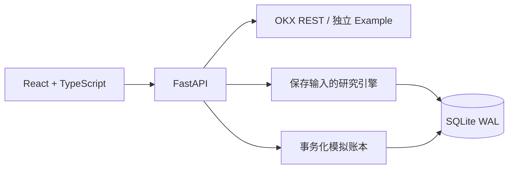

# Tidebench

**Evidence before execution. 先验证，再决策。**

从 OKX 公共行情出发，让加密资产研究与模拟交易的每一步都可检查、可追溯。

[](https://github.com/billpwchan/tidebench/actions/workflows/ci.yml)
[](LICENSE)
[](pyproject.toml)
[](frontend/package.json)

[English](README.md) · 简体中文 · [快速开始](#快速开始) · [架构](docs/architecture.md) · [参与贡献](CONTRIBUTING.md)


**开发者预览版 · 仅现货 · 本地模拟成交。** Tidebench 通过 REST 轮询读取真实 OKX 行情，模拟订单只写入本地账本。它既不连接 OKX 模拟盘，也不提交实盘订单；无需提供交易所 API 密钥，当前版本也不接受这类凭据。

## 为什么做 Tidebench

一份回测应当附带足够的证据：使用了哪些数据，信息何时可用，按什么价格成交，扣除了哪些成本，以及账户发生了什么变化。

Tidebench 把这些证据放进同一个交互工作台，用于观察市场、比较实验和跟踪模拟账户。

| 想确认的问题 | 可以检查的证据 |
| --- | --- |
| 结果用了什么数据？ | 保存的 K 线、交易规则、数据集哈希与带版本的 manifest |
| 以后还能重现吗？ | 使用原始输入快照重新运行，导出输入与结果 JSON |
| 当时真的能做出这个决策吗？ | 已收盘信号、下一根开盘成交，以及明确的手续费和滑点 |
| 账户为什么变了？ | Decimal 余额、平均成本持仓、成交与审计事件在同一事务提交 |
| 什么情况下阻止新增风险？ | 在成交事务中检查订单、敞口、亏损阈值和持久化停止开关 |
| 离线可以体验吗？ | 明确标注的合成 Example 数据，拥有独立账户和研究记录 |

## 快速开始

准备 **Python 3.12–3.14**、[uv](https://docs.astral.sh/uv/getting-started/installation/)、**Node.js 22.12+**、Git 和 Make。Docker 构建使用 Node.js 24。

```bash
git clone https://github.com/billpwchan/tidebench.git
cd tidebench
make setup
make dev
```

打开 **[localhost:5173](http://localhost:5173)**。`make dev` 同时启动 API 与 Vite，按 Ctrl+C 结束。

在数据源选择器中选择 **Example**，即可离线体验。它生成固定时钟下的确定性合成价格，与 OKX 行情隔离，也不会伪装成不断更新的实时行情。

1. 查看市场，进入 Research。
2. 设置策略、手续费、滑点和资金比例，运行实验。
3. 检查权益曲线、成交记录和 manifest；导出结果或按快照重放。
4. 提交本地模拟订单，查看账户变化，再验证风险阈值或停止开关。

选择 **OKX** 需要能够访问所选区域的公共接口。连接失败会明确显示，不会悄悄切换到 Example 数据。

### 本地运行构建后的工作台

```bash
make build
uv run python -m tidebench
```

打开 **[localhost:8000](http://localhost:8000)**。一个 Python 进程同时提供前端静态文件、API 和后台监督任务。数据保存在 `./data`；同一数据库只运行一个进程、一个 worker。

### Docker

先在本地生成工作区访问令牌：

```bash
cp .env.example .env
python3 -c "import secrets; print(secrets.token_urlsafe(32))"
```

继续前，将生成的值填入 `.env` 的 `TIDEBENCH_API_TOKEN`。使用至少 32 个随机字符，并保持 `.env` 私密。

```bash
docker compose up --build
```

打开 **[localhost:8080](http://localhost:8080)**，在 Settings 中填写这个**工作区令牌**。它用于保护 Tidebench，与交易所 API 密钥是不同的凭据。Compose 通过命名卷保存账户与研究数据。

容器 CI 会构建镜像，并对健康检查与经过认证的合成数据 API 做运行冒烟测试。实际结果以工作流为准；这些检查不等于生产运行成熟度评估。

### 区域行情接口

通过环境变量或 `.env` 将 `TIDEBENCH_REGION` 设置为 `global`（默认）、`us` 或 `eea`：

```bash
TIDEBENCH_REGION=us make dev
```

各区域可用交易对可能不同。详见 [OKX 集成与数据条款](docs/okx-integration.md)。

## v0.1 已实现范围

| 模块 | 当前范围 |
| --- | --- |
| 市场 | BTC-USDT、ETH-USDT、SOL-USDT、OKB-USDT、DOGE-USDT，取决于区域可用性 |
| K 线周期 | `15m`、`1H`、`4H`、`1Dutc` |
| 策略 | SMA 均线交叉、Wilder RSI 均值回归、买入持有 |
| 研究 | 60–2,000 根已收盘 K 线、输入快照、质量校验、成本假设、基准、导出与重放 |
| 模拟交易 | 手动订单与策略监督；OKX 数据账户和 Example 账户独立持久化 |
| 控制 | 持久化幂等、现金与库存校验、订单和敞口限制、观测日亏损阈值、停止开关、审计日志 |
| 界面 | 市场图表、研究、模拟持仓、风险与工作区设置 |

历史回测按下一根 K 线开盘成交。向前运行的模拟策略使用信号收盘后观测到的买一/卖一价格，并计入轮询延迟、价格精度与模拟成本，因此两者的成交和盈亏可能不同。模拟交易固定采用 **10 bps 手续费和 5 bps 不利滑点**；历史研究允许设置这两个参数。

## 架构



后端采用模块化单体，核心引擎仅使用 Python 标准库与 Decimal，后台计算有明确边界。前端使用 Vite、TanStack Query 和 Lightweight Charts。SQLite 事务串行提交账户变更，进程锁约束单实例运行。

具体行为见 [架构说明](docs/architecture.md)、[API 契约](docs/api-contract.md) 和 [研究引擎契约](docs/research-engine.md)。[交易员产品规格](docs/trader-product-spec.zh-CN.md) 与 [独立架构挑战](docs/architecture-review.md) 说明商业目标及必须承受的故障场景。

<details>
<summary>研究工作台：假设、基准、成交与快照重放</summary>


</details>

## 验证

```bash
make check
cd frontend && npx playwright install chromium && cd ..
make browser-test
```

检查包括 Python lint/格式、引擎与后端测试、前端构建；浏览器测试覆盖用户流程。测试涵盖未来数据扰动、前缀重放、费用与精度、并发订单去重、事务回滚、账本重放、停止竞态和队列准入。

上方 CI 徽章连接真实 workflow。[验证记录](docs/verification.md) 列出观察结果及尚未验证的边界。测试通过证明的是具体检查结果，不代表生产成熟度或策略盈利能力。

## 模型与部署边界

- 仅模拟无杠杆现货多头；不支持做空、衍生品或交易所执行。
- K 线无法还原盘中路径、订单队列、部分成交或市场冲击。买入持有基准采用全仓比例，可能与策略的资金比例不同。
- 少于 **30 个完整 UTC 日收益样本**，或收益波动接近零时，Sharpe 显示不可用。30 个样本并不能证明统计显著。
- 手续费统一模拟为 USDT；交易所逐币种费用与账户对账仍是后续工作。
- 日亏损基线是该 UTC 日**首个成功模拟命令在完整、新鲜估值下的成交前权益**；不是精确午夜净值，也不是持续覆盖全账户的日内止损。
- 一个工作区、一个操作者、一个进程、一个 SQLite writer；当前不提供多租户授权、分布式执行或可用性保证。
- Example 使用固定时钟。示例策略评估现有最新 K 线后，会等待新的数据。

停止开关阻止所有新增模拟成交并保留持仓；停止策略同样保留持仓。已经提交的命令仍可通过幂等键取回，不会因此再次成交。

## 路线图

| 已可使用 | 后续计划，需满足对应准入条件 |
| --- | --- |
| 校验后的 OKX REST 行情与隔离合成示例 | WebSocket 接入、重连和缺口恢复 |
| 保存输入的 K 线研究与重放 | 更大数据集、滚动样本外验证与研究目录 |
| 事务化本地现货模拟账本 | 交易所模拟盘适配、对账和部分成交处理 |
| 单工作区访问与风险控制 | PostgreSQL、worker fencing、可观测性与恢复演练 |
| 本地交互工作台 | 用户研究、无障碍审查与更广泛的流程验证 |

私有交易接口需要独立设计审查与验收证据。详见 [商业化准备门槛](docs/commercial-readiness.md)。

## 文档与贡献

- [产品方案与自我挑战](docs/product-plan.zh-CN.md)
- [交易员工作流与商业目标架构](docs/trader-product-spec.zh-CN.md)
- [独立架构挑战与故障场景](docs/architecture-review.md)
- [架构与风险语义](docs/architecture.md)
- [研究引擎与指标假设](docs/research-engine.md)
- [OKX 数据集成与授权](docs/okx-integration.md)
- [商业化准备门槛](docs/commercial-readiness.md)
- [发布说明与传播草案](docs/launch.md)

欢迎审查因果性、账本不变量、数据质量和使用体验。先阅读 [CONTRIBUTING.md](CONTRIBUTING.md)，通过 [issue](https://github.com/billpwchan/tidebench/issues) 提供可复现案例，或提交范围清晰的 PR。安全问题请按 [SECURITY.md](SECURITY.md) 处理。

## 开源许可与数据权利

原创应用代码采用 [MIT License](LICENSE)。该许可不授予交易所行情、服务或商标的使用权。仓库不打包真实 OKX 历史数据；本地获取的行情与导出仍受数据提供方条款约束，托管服务或商业再分发需要另行评估。详见 [数据权利](docs/okx-integration.md#data-rights-and-commercial-scope)。
