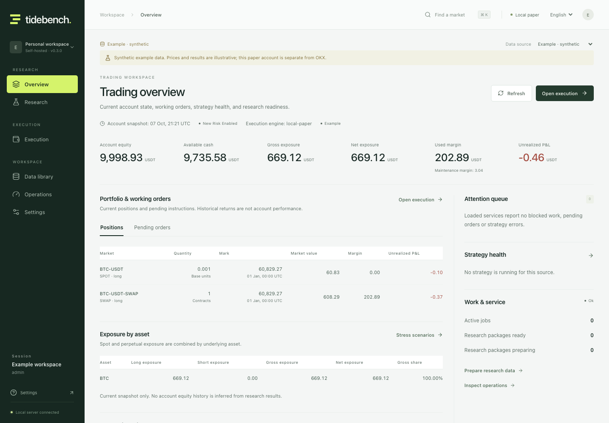
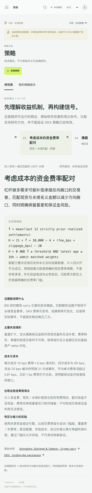
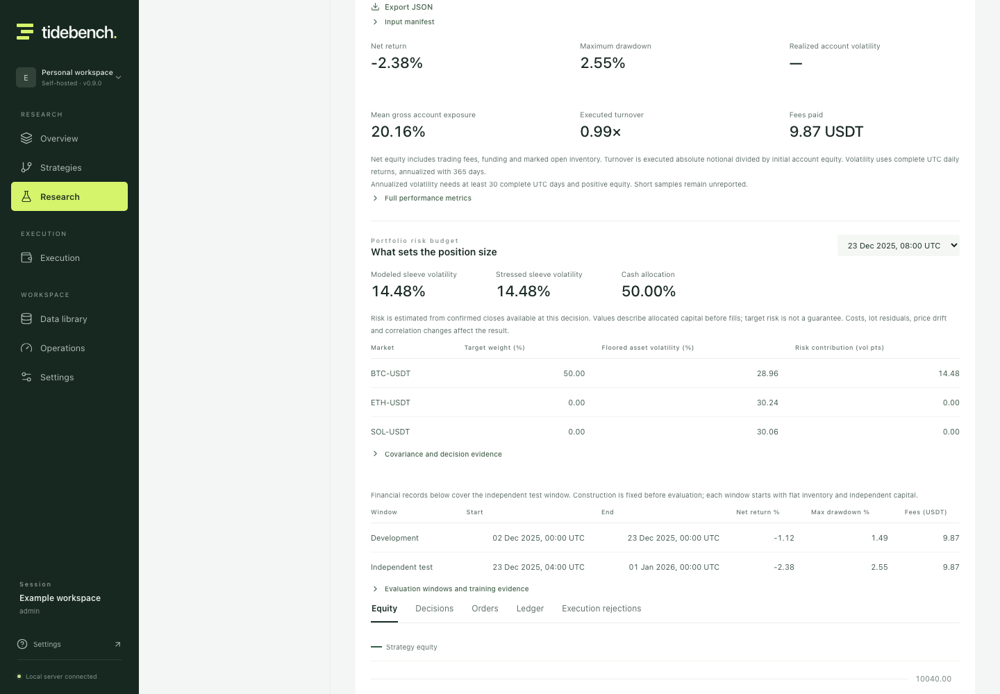
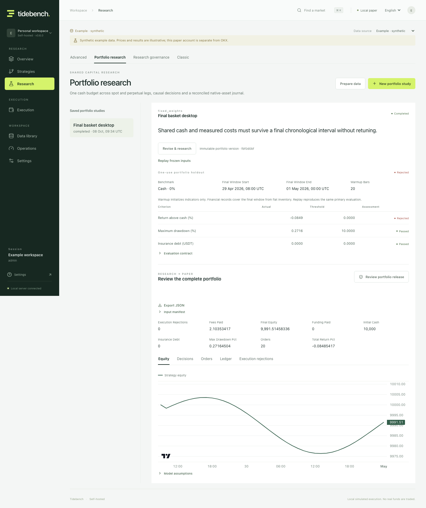
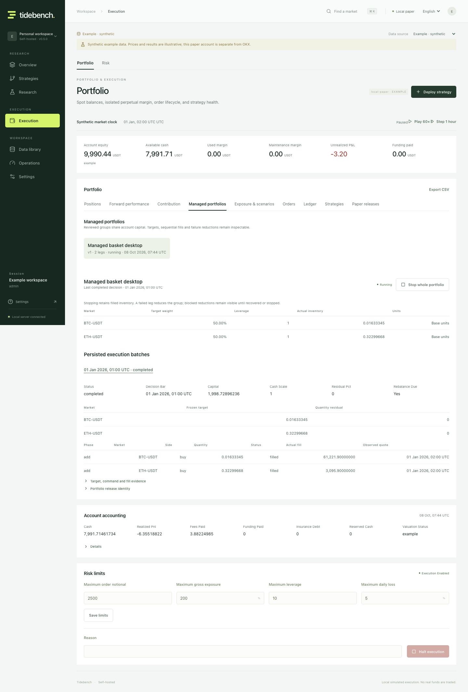
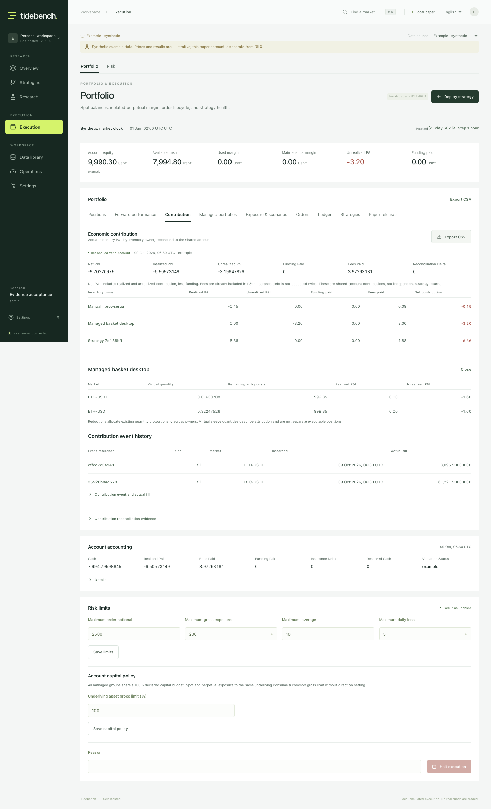

# Tidebench

**先有证据，再谈执行。**

面向 OKX 现货与 USDT 线性永续的开源量化研究与模拟交易工作台。保存经济假设与不可变组合版本，研究共同资金下的目标，通过全组审批进入前向模拟，再把实际成交、风险与贡献账本连起来核对。

[](https://github.com/billpwchan/tidebench/actions/workflows/ci.yml)
[](LICENSE)

简体中文 · [English](README.md) · [研究模型](docs/pro-research.md) · [部署与运维](docs/operations.md)



不可变策略／组合版本、可重放研究、全组审批、持久目标及命令构成连接的工作流。多市场执行中断后先核对已成交命令；失败腿和补偿受阻保留真实库存；实际货币贡献与共同账户核对。参见[策略工作流](docs/strategy-workflows.md)、[托管组合与归因指南](docs/managed-portfolios.md)及[当前自审](docs/audit/README.md)。

品种证据保留完整前向 REST data 数组，包括规则尚未补全的新上市条目；支持响应比较、缺失规则审阅、指定 UTC 时间的已知信息查询和精确哈希导出。较早的上市时间戳不会被包装成完整历史覆盖。[观察与恢复指南](docs/instrument-evidence.md)。

## 策略机制、可执行模型与真实反证

双语研究库覆盖周级动量、条件回归、现货／永续资金费率配对、相对强度轮动与收盘通道突破。新增两个共享因果信号模型，并把资金费率的样本、时效及四次成交成本门槛接入历史与持久化前向模拟。每个研究档案提供公式、原始来源、失效情形与淘汰实验，可直接加载配方保存版本。

[真实 OKX 的 108 案例](docs/strategy-research.md)保留相邻参数、双倍成本与消融的全部结果。默认动量仅 4/12 个相关情景为正，回归为 6/12；过滤器未一致改善结果。这是公开的探索性反证，不是已盈利策略宣传。捕获重放验证了全部输入／结果哈希。



### 仓位配置也需要独立验证

[风险预算动量组合](docs/portfolio-risk-research.md)把逐腿上限、因果协方差、波动率倒数配置、相关性压力和现金仓位接入研究 → 审批 → 持续模拟。每次决策均可检查风险输入与贡献，并对照账户实际波动、敞口及换手。

公开 **28 项两年 OKX 检验**：回撤降低伴随仓位下降；双倍成本 B 时段主模型仅剩 **0.17%**，相邻估计窗口为亏损。产品保留这些反证，不把减仓等同于超额收益。




## 当前支持的工作流

| 工作区 | 能力 |
|---|---|
| 总览 | 真实模拟仓位、待执行订单、资产敞口、风险提示、策略状态与研究任务 |
| 行情 | OKX 真实公开行情、确认 K 线与时间戳；可显式切换独立合成数据 |
| 数据库 | 一键研究数据包：交易价、标记价、实际资金费及结算时点价格齐备才可交给研究；不可变版本、断点续传、阻断原因、来源与导入 |
| 策略 | 不可变假设与定义；七类信号、有界规则程序、退出／亏损预算与可编辑研究起点 |
| 研究 | 绑定策略版本的回放、网格、成本压力、训练／测试、walk-forward；单策略及冻结输入组合的一次性最终评估、共享市场时间保护与跨 run 试验记录 |
| 组合研究 | 不可变假设及版本；2–10 个同步市场共用现金；固定权重、独立信号、动量与资金费 carry；带拒绝条件的参考假设及时间切分测试 |
| 托管组合 | 全组审查／激活、持久目标及命令、共同现金缩放、残差限制、全组停止与可恢复减仓补偿 |
| 贡献归因 | 实际所有者的数量、成本、P&L、费用及资金费与净账核对；成交／事件证据、分页及导出 |
| 执行 | 同一账户内的现货库存与逐仓永续；订单预览、市价／限价／止损模拟、现金预留、取消、杠杆与保证金 |
| 风险 | 资产／市场总敞口与净敞口、集中度、逐仓保证金缓冲、自定义价格压力与捕获导出；事务内限制及持久暂停 |
| 运维 | 用户／角色、会话、CSRF、审计、行情年龄、进度健康、独立研究进程、持久异常处置、每日备份及真实恢复 |

研究只使用已确认收盘的信息，历史成交最早发生在下一根开盘。参数选择只使用训练数据；测试折独立起始，不把重叠样本拼成一条看似连续的收益曲线。

永续模型分别使用交易价与标记价，按合约面值换算数量，使用实际已结算费率及捕获的维持保证金档位。历史分钟价格近似、当前档位情景等假设在结果中可见。穿仓会形成明确负债并停止新增模拟风险，不会从收益中消失。

**执行范围是本地模拟。** 真实数据来自公开 API；程序不发送交易所订单，不需要也不接受交易所密钥。Docker 部署与本地运行使用相同的执行范围。

## 启动

需要 Python 3.12–3.14、[uv](https://docs.astral.sh/uv/getting-started/installation/)、Node.js 22.12+ 与 Make。

```bash
git clone https://github.com/billpwchan/tidebench.git
cd tidebench
make setup
make dev
```

打开 [localhost:5173](http://localhost:5173)，创建首位管理员。没有内置账户；密码至少 12 字符。会话保存在 HTTP-only Cookie 中。

离线体验时选择 **Example**：

1. 在 Strategies 载入参考假设或自定义策略，保存不可变版本，点击 Research this version。
2. 在 Data library → Research packages 选择现货或永续及 UTC 日期，一键准备研究数据包。永续会收集交易价、标记价、实际资金费与结算时点价格，全部校验后才就绪。
3. 在绑定版本的研究中选择已校验数据，设置成本和独立测试窗口，导出或重放证据。Research governance 可在评估前冻结一次性保留集；组合协议捕获完整输入、固定现金基准与拒绝判据，支持哈希一致的冻结重放。[协议与恢复指南](docs/research-governance.md)。
4. 从研究结果 Review paper release，核对候选、成本和当前风险政策，批准并激活。在 Execution 推进合成时钟，查看实际决策、订单、退出、净值与压力情景。
5. 多市场流程在 Portfolio research 选择同步就绪数据包并保存绑定版本的研究。Review portfolio release 审查整组；Execution → Managed portfolios 显示冻结目标、共同现金缩放、实际命令及残差；Contributions 核对该组货币 P&L。详见[指南](docs/managed-portfolios.md)。
6. 在 Operations 创建、校验备份。恢复会撤销所有会话、取消待执行订单／命令、停止全组并暂停账户新增风险。

Example 使用可暂停、加速和向前步进的合成行情时钟与独立账户。OKX 连接失败会明确显示，不会自动换成假数据。



构建后的统一服务：

```bash
make build
uv run python -m tidebench
```

打开 [localhost:8000](http://localhost:8000)。一个 Python 进程运行前端、API 和后台服务，数据持久化在 `./data`。

Docker：复制 `.env.example` 为私有 `.env`，生成至少 32 字符随机值并填入 `TIDEBENCH_BOOTSTRAP_TOKEN`，再运行 `docker compose up --build`。打开 [localhost:8080](http://localhost:8080)，首次创建管理员时填写该初始化令牌。HTTPS、角色、备份和升级步骤见[运维手册](docs/operations.md)。

## 可检查的实现

- [一键研究数据包、结算价格与不可变交接](docs/data-packages.md)
- [资产敞口、逐仓缓冲与可重放价格压力](docs/portfolio-risk.md)
- [数据版本、分页、导入及资金费覆盖](docs/data-operations.md)
- [研究、样本外评估及永续模型](docs/pro-research.md)
- [一次性组合最终评估与恢复后的研究事实](docs/research-governance.md)
- [托管组合、失败处置与实际贡献归因](docs/managed-portfolios.md)
- [后端架构与持久化边界](docs/architecture.md)
- [部署、权限、备份与恢复](docs/operations.md)
- [真实验收记录](docs/verification.md)
- [当前范围与证据边界](docs/commercial-readiness.md)

```bash
make check
cd frontend && npx playwright install chromium && cd ..
make browser-test
```

测试覆盖因果性、重放、资金费去重、保证金档位、账本平衡、并发订单幂等、全组停止竞态、首笔成交后进程硬退出恢复、失败腿补偿、混合所有者归因、权限／CSRF 和真实 SQLite 恢复。桌面及移动浏览器流程也纳入验收。





## 模型与部署边界

REST 轮询面向 K 线研究和前向模拟；本地订单采用全额成交模型，不能重建订单队列、部分成交、冲击成本或历史真实盘中路径。公开资金费历史有保留期限；更早的数据需要注明提供方和覆盖声明的导入。缺失结算证据会阻断永续研究与对账。

多市场托管组合、货币贡献归因及冻结输入的一次性组合最终评估已有实现。研究预留、暴露、消费及试验事实在恢复时保留较新记录，旧备份不能重新开放已消费测试。公开数据和平台外实验不属于盲化保障。当前市场集合不能证明完整历史上市／退市及合约生命周期覆盖；盘口容量和长期外部运维也需要各自证据，详见[当前自审](docs/audit/red-team-0.6.0.zh-CN.md)及[历史交易池设计](docs/historical-universe-design.md)。

当前是支持多角色用户的共享工作区，单进程、单 SQLite 写入者；不提供租户隔离或分布式容灾。实际测试证明特定行为，不证明长期可用性或策略盈利能力。

欢迎提交可复现问题，以及关于研究正确性、账本、数据质量和交易员体验的改进。见 [CONTRIBUTING.md](CONTRIBUTING.md) 与 [SECURITY.md](SECURITY.md)。

## 许可

原始应用代码采用 [MIT](LICENSE)。代码许可不授予交易所数据、服务或商标权；仓库不包含真实 OKX 数据集。商业托管或数据再分发须满足适用提供方条款，详见[数据权利](docs/okx-integration.md#data-rights-and-commercial-scope)。
