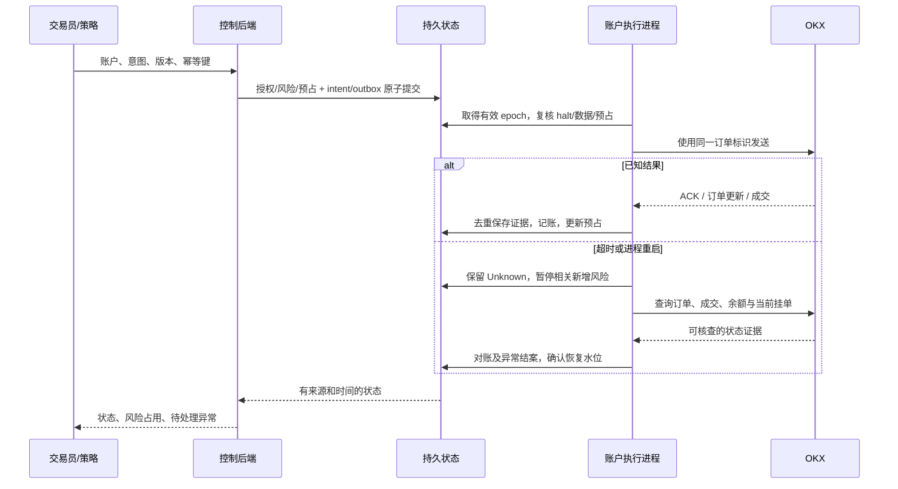

# 商业架构反方评审

本文记录以 v0.1 为基线的升级前反方评审。v0.2 已实施版本化数据、样本外研究、统一模拟账本、资金预留、角色会话、备份恢复及故障注入验收，详见[当前架构](architecture.md)和[验收记录](verification.md)。涉及交易所 OMS、私有对账、多租户和实盘的建议仍属于更大范围的目标；下文的“当前”描述保留原评审时点。

评审日期：2026-10-08。目标用户是独立专业交易员与小型交易团队。**除“当前边界”外，本文均为尚未实现的设计建议和验收要求**，不是当前功能、生产认证或可用性承诺。评审重点是资金与操作正确性；盈利能力需要独立研究。

## 1. 先验证交易员工作流

交易员开盘前要确认账户、可用资金、未完成订单、数据完整性与策略版本；盘中要解释持仓变化、控制新增风险、处理异常订单；交班时要交付可追溯状态。商业产品应首先回答：**现在实际有什么仓位、还有多少挂单风险、哪些状态未知、谁正在负责、下一步可以安全做什么？**

主工作区应围绕账户与任务组织，提供持仓/挂单/成交联动、期望仓位与实际仓位差异、策略归因、数据时间、风险占用、异常处理及交班记录。图表与研究是重要入口，但不是运行状态的替代品。异常必须有对象、原因、责任人与处理动作；不能用总览页一个绿色状态灯代替账户级证据。

先访谈现货方向交易员与小型自营团队，验证其实际订单频率、持仓周期、外部手动交易、交班方式及可接受恢复窗口。做市、衍生品与高频执行有不同的微观结构和运营要求，不应借一个“专业版”标签同时承诺。

## 2. 当前边界与商业目标的差距

当前预览具备有限现货 REST 行情、固定范围 bar 回测、保存输入复现、单操作员本地 paper 账本及进程内风险控制。其 SQLite 单 writer 与进程租约是合理的明确边界。

升级 PostgreSQL 不能自动得到交易平台：目前没有交易所 OMS、资金预占、多资产手续费记账、启动/持续对账、外部成交归属、多租户授权、私钥托管、独立风险执行权或经过演练的恢复体系。现有观察日损失基线也不是持续、现金流中性的日内风险指标。上述差距决定后续开发顺序，不能靠换数据库和加入消息队列掩盖。

## 3. 建议的责任与状态边界

保持模块化控制后端；首先只把有故障隔离需要的研究任务、行情接入与账户执行进程分开。不是每个模块都需要独立微服务。

| 边界 | 权威记录与职责 |
| --- | --- |
| 数据与研究 | 记录供应商/区域、事件时间/接收时间、序列与完整性、水位、instrument 版本、历史修订关系。数据快照不可变；策略、代码、成本与执行模型一起进入 manifest。更正产生新版本，不覆盖旧结果。 |
| 账户与组合账本 | 按原生币种复式记账，保留成交、手续费/返佣、充值、转账与调整凭证；数量、成本、估值与策略归因分开。交易所余额是对账证据，不能直接覆盖账本。未知价格使估值不可用，不把资产记成零。 |
| OMS / RMS | OMS 管理意图、订单证据、成交与资金预占；RMS 管理账户/策略/品种限额、挂单风险、价格保护与数据健康。所有入口，包括手动操作，都走相同授权与风险通道。 |
| 账户执行 | 同一交易所账户只有一个有效执行权持有者；共享账户的人工与多策略库存必须有明确归属。未归属的外部交易保留为 external，进入异常处理，不能自动分给最近启动的策略。 |
| 租户与密钥 | 服务端验证的租户上下文贯穿查询、缓存、异步任务、导出与审计；研究进程没有交易密钥。私钥按账户/环境隔离，由受限签名端使用，支持吊销与轮换。 |

账户变更采用数据库事务、唯一约束、账户级锁/适当隔离以及 outbox。事务内不调用交易所。数据库提交与外部下单之间不存在一个共同原子事务，必须承认 Unknown 状态和可恢复对账。PostgreSQL 的 Serializable 也要求处理整个事务重试，不能将一次重试直接变成第二次外部下单。[PostgreSQL 隔离说明](https://www.postgresql.org/docs/current/transaction-iso.html)

## 4. 最危险的十种失效与验收

以下是不变量和未来故障注入验收，**当前测试不代表已覆盖这些商业场景**。

| # | 失效 | 必须保持的不变量 | 注入与通过条件 |
| --- | --- | --- | --- |
| 1 | 行情仍连通但过期、盘口断序或缺 bar | 无同步证明不得增加风险；各账户使用自己的数据健康状态 | 丢包/乱序/延迟快照；暂停新增风险，补齐并验证后恢复，UI 可解释停顿 |
| 2 | tick/lot/合约单位或 instrument 变化 | 意图绑定规则版本和单位；发送前再校验 | 在审批与发送间更改精度/停牌；旧意图被拒绝或重新审批，不截断数量偷偷发送 |
| 3 | 交易所接收后连接断开 | 同一意图不因超时生成另一笔风险；Unknown 不等于失败 | 在接收、ACK、落库各边界杀进程；恢复查询既有订单，未知期间不自动重下 |
| 4 | 撤单 ACK 后仍有成交，或重复/迟到成交 | 累计成交与原生手续费只记一次；撤单请求不是终态 | 交换 ACK/fill/cancel 顺序并重复投递；最终订单、库存、余额一致 |
| 5 | 双 worker 与过期 leader 同时执行 | 每账户只有一个有效发送权；旧 epoch 不能签名/发送 | 网络分区后启动新 leader；在签名/出口层拒绝旧 leader。仅 DB fencing 不够，交易所不认识本地 epoch |
| 6 | 多币手续费、返佣、转账或手动交易漏账 | 每币种借贷平衡；账本重放与资产变化一致 | 注入 BTC 手续费、返佣及外部成交；保留币种和凭证，差异进入对账，禁止无凭证“修余额” |
| 7 | halt、限额更新与排队订单竞态 | 发送时检查最新策略；已在途风险明确可见 | 预占后 halt，再唤醒 outbox；未发送命令不能外发。在途订单继续对账，不能宣称 halt 瞬间消除所有风险 |
| 8 | 租户串读、缓存串号或密钥泄露 | 每条对象访问/任务/导出都重新确认所属；密钥不进入通用日志/UI | 篡改租户与账户 ID、复用任务、诱发异常；拒绝越权，日志脱敏且能定位责任主体 |
| 9 | 重启或入金重置日亏损，缺报价掩盖敞口 | 日风险基线持久化、现金流中性；缺失估值不能放大额度 | 跨 UTC 日、时钟偏移、入金及缺报价；不重置已消耗风险，不把未知权益当可用资金 |
| 10 | 从旧备份启动并重放已发送命令 | 未完成恢复/对账不得取得执行权；历史不足不可猜测 | 恢复旧数据库并让交易所继续成交；核对余额、订单、fills 与水位。超出可查询历史时停在人工恢复状态 |

OKX 官方明确 ACK 与最终订单状态的区别，并要求结合订单更新与查询管理状态。这支持上述状态机要求，不提供应用层 exactly-once 保证。[OKX 交易实践](https://www.okx.com/docs-v5/trick_en/)

## 5. 指令顺序与重启顺序

重启必须先加载账户规则与风险状态，获取独占执行权，恢复命令/订单/账本，接入并缓冲私有更新，获取 REST 状态与历史，再合并去重、检查差异、建立数据水位，最后由策略决定是否恢复。缓冲与快照之间没有天然全局顺序时，应再次对账；不能用“WS 已连接”解锁交易。历史保留窗口不足要显式升级处理。

## 6. 买还是自建

**自建产品差异：** 交易员工作流、异常处理、策略归因、审批、数据证据、可复现研究与组织治理。**采购/复用通用能力：** 托管 PostgreSQL 与备份、OIDC、KMS/secret manager、可观测性基础设施、合规授权的数据服务。自建受限 bar 引擎仍适合当前可解释现货研究；不把它自然扩张成盘口、部分成交、衍生品 OMS。

NautilusTrader 是事件驱动数据/执行内核的候选依赖，必须通过版本锁定和集成 PoC 决策。2026-10-08 官方 `latest` 安装文档对应 **2.x RC**，明确不建议 RC 控制真实资金；不带 `--pre` 则安装 1.x，不能运行 2.x 文档样例。因此“接正式版”不是一个已完成选择。[官方安装说明](https://nautilustrader.io/docs/latest/getting_started/installation/)、[发行记录](https://github.com/nautechsystems/nautilus_trader/releases)

PoC 必须核对匹配发行版本的 OKX 地域/环境支持、instrument 更新、部分成交、多币手续费、Unknown 保留、外部订单归属、对账窗口、持久化与升级兼容。官方 latest OKX 文档显示其 submission retention 并非自动开启，默认检查耗尽可能在本地解决未确认状态；本产品不能因此推断交易所没有订单并重新下单。历史 lookback 也有边界；使用内核不免除治理责任。通过后只保留一个权威 OMS/成交投影；不要让自研与 Nautilus 同时拥有同一账户状态。未通过则继续受限研究产品，不以绕过验收的自研实盘替代。[OKX adapter](https://nautilustrader.io/docs/latest/integrations/okx/)、[执行对账](https://nautilustrader.io/docs/latest/concepts/execution/reconciliation/)

## 7. 运营与推进门槛

可观测性围绕交易事实：逐品种数据 age/缺口、Unknown 数量与年龄、逐币对账差异、预占风险、发送权冲突、风险拒绝原因、订单生命周期和恢复耗时。命令→订单→成交→账本→对账以相关 ID 串联；业务审计与调试日志分开，指标不携带密钥。采用标准 traces/metrics/logs，再针对实测工作负载设 SLO。[OpenTelemetry 信号](https://opentelemetry.io/docs/concepts/signals/)

运营责任必须明确：谁接警、谁冻结新增风险、谁处理外部订单、谁批准恢复、谁验证备份。承诺 24/7 托管前要有实际轮值、事故分级、交班、恢复手册及演练证据；RPO/RTO 由用户损失容忍度与测试结果决定。租户隔离必须覆盖异步消费者与导出；密钥管理应覆盖授权、轮换、吊销与审计，不能只做数据库加密。[OWASP 多租户](https://cheatsheetseries.owasp.org/cheatsheets/Multi_Tenant_Security_Cheat_Sheet.html)、[密钥生命周期](https://cheatsheetseries.owasp.org/cheatsheets/Secrets_Management_Cheat_Sheet.html)

推进顺序：**交易员访谈/流程原型 → 版本化数据与研究验收 → 账本/OMS/RMS 状态模型及故障注入 → 锁版本的执行内核 PoC → 单租户 OKX Demo 持续对账与恢复演练 → 租户安全/运营/数据授权验收 → 单独评审受控实盘。** 不用日历或 star 数跳过阶段。商业行情/第三方服务授权是独立门槛，公开 API 与开源代码许可不自动赋予这些权利。[OKX API Agreement](https://www.okx.com/help/okx-api-agreement)

关联：[当前架构](architecture.md) · [发布门槛](commercial-readiness.md) · [数据边界](okx-integration.md)
