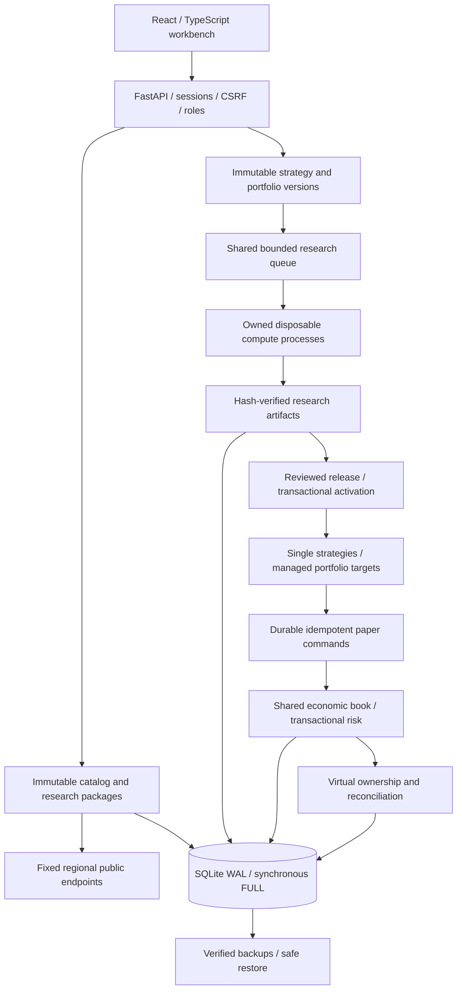

# Architecture

Tidebench is a single-workspace modular monolith for public market ingestion, reproducible research and local spot / linear USDT perpetual paper execution. Named users share the account and research library under role-based permissions. One process owns one SQLite WAL database; a canonical file lease enforces that boundary. Current workspace schema is 5.

## Ownership

| Module | Owns |
|---|---|
| `market.py` | Regional HTTP transport, throttling, retries, validated spot quotes and legacy candles |
| `catalog.py`, `data_packages.py` | Rules/history, immutable datasets, attributed imports, funding marks, fenced downloads and verified multi-dataset handoff |
| `engine.py`, `derivatives.py`, `pro_research.py` | Indicators, causal finite-Decimal replay, margin/funding/liquidation and bounded single-market plans |
| `strategy_registry.py`, `research_governance.py` | Immutable single-strategy definitions/releases, project trials and one-use holdout access |
| `strategy_program.py`, `strategy_risk.py` | Typed bounded programs, causal close exits and loss-budget sizing |
| `portfolio_registry.py`, `portfolio_releases.py` | Immutable multi-market definitions, exact research binding, whole-group review and activation |
| `portfolio_construction.py`, `portfolio_targets.py` | Pure construction weights, lot-rounded quantities, reductions and common-cash addition plans shared by history and forward control |
| `portfolio_research.py` | Shared-capital historical portfolios and independent chronological test accounts |
| `managed_portfolios.py` | Group ownership, target batches, frozen commands, interruption recovery, residual limits and reduce-only compensation |
| `pro_execution.py` | Authoritative economic account, spot/margin inventory, native-asset journal, reservations, funding, risk and atomic orders |
| `contributions.py` | Transactional virtual owner quantities/cost/P&L, exact finite sums, explicit reconciliation and auxiliary-data quarantine |
| `portfolio_analytics.py` | Read-only captured exposure, isolated maintenance and price-shock settlement |
| `forward_history.py`, `forward_performance.py`, `simulation_clock.py` | Incremental bar state, verified decisions, actual account equity observations and durable synthetic time |
| `research_artifacts.py`, `research_budget.py`, `research_process.py`, `provenance.py` | Shared compressed evidence, bounded admission, disposable computation and installed source/result identity |
| `pro_service.py`, `operations.py` | Five supervised loops, owned/drained work, progress health, persistent incidents and backups |
| `platform.py`, `pro_api.py`, `main.py` | Users/sessions, API boundaries, request metrics, lease/migrations, maintenance and verified recovery |
| `paper.py`, `worker.py` | v0.1 compatibility; legacy paper records remain separate from professional capital |

Money is transmitted and persisted as decimal strings. Core financial operations use an explicit 50-significant-digit half-even context and finite supported domain. Chart coordinates/display formatting may use JavaScript numbers. Spot quantity is base units, perpetual quantity is contracts, and prices are USDT per base asset. Native-asset journal adjustments are explicit; material imbalance fails closed.

## Persistence and financial authority

Mutations use `BEGIN IMMEDIATE`, foreign keys and `synchronous=FULL`. Economic orders, risk checks, reservations, balances, positions, journal entries, strategy cursor and audit records commit atomically. A source-scoped command key deduplicates retries, including during data outages; a different payload under the same key conflicts. Per-market async locks serialize funding reconciliation and position changes, while the fill transaction remains the authority for current ownership, stop and risk conditions.

Contribution ownership is auxiliary to this net book. Actual fills and settlements update virtual sleeves and hash-bound events in the same transaction. Mixed owners retain their own entry costs and receive proportional reductions/funding; exact finite remainder handling prevents hidden virtual inventory on full close. The contribution report reads economic and ownership state in the same SQLite snapshot. It exposes monetary contribution, not independent sleeve capital or returns. Reconciliation currently scans retained sleeve history per economic update; long-lived closed-owner accumulation remains a capacity optimization target.

Corrupt contribution state blocks new risk. Valid protection/settlement can commit while a savepoint rolls back only failed auxiliary changes, captures economic evidence, persists attribution quarantine and halts increases. Damaged sleeves remain unchanged for investigation; reports cannot claim reconciliation until an explicit recovery. This avoids making auxiliary corruption a barrier to de-risking.

## Data and research identity

Catalog records and page cursors commit together; worker tokens fence cancellation/restart races. Research packages own their component downloads, collect settlement marks in bounded batches and publish only after identity/coverage checks. A bound run must match the exact package, window and manifest hash. Dataset gaps, transport errors and unavailable funding remain explicit.

Research captures instrument rules, dataset manifests, enriched settlement observations and margin-tier scenarios before computation. Input snapshots retain normalized evidence for offline reproduction. Manifests record installed module hashes, Python/version and Decimal context; completed results have a canonical SHA-256. Replay uses captured inputs and fails on full-result divergence. History summaries/keyset pagination do not decode every financial array. Selected detail omits unselected arrays; full exports preserve reconstructible evidence.

Portfolio versions pin hypothesis, construction, ordered markets and leg policies independently of their data packages. Approval pins a completed current-implementation result, immutable version, execution policy and acknowledgements. Activation revalidates all reviewed conditions and creates group/leg ownership in one transaction. Existing inventory is never silently adopted. Portfolio-specific sealed holdouts and trial governance remain separate from the existing single-strategy controls.

## Supervised work and resources

Five professional loops own research, catalog, risk/order execution, strategies and backups. Readiness checks database access, expected supervisors and recent progress; operational conditions become persistent incidents. Acknowledgement does not hide a failing condition. These controls are observable local health contracts, not a demonstrated production SLO.

Single-market and portfolio computation share a bounded queue and plan budgets. Default limits include ten queued runs, 64 cases, 20 folds and two million bar-cases. Individual research windows allow at most 98,000 selected bars plus warmup. Owned disposable interpreters use fixed entrypoints and private JSON files, no workspace database or inherited workspace credentials. Parent deadlines, maintenance cancellation, a portable owner watcher and Linux parent-death signal kill/reap children. Linux CPU/additional-address-space limits supplement input/output caps; they are not total RSS enforcement. Apply host/container limits as well.

Storage offloads are tracked and drained before releasing the process lease or replacing the database. Strategy evaluation allows up to four concurrent children with 60-second deadlines. Managed groups consume the same supervision budget; their member legs are not independently evaluated. Active scheduling and unresolved attention queries are independent of the UI history limit; the UI retains all active groups plus up to 200 recent non-active groups. Active leg ownership is bounded to twenty deployments and pending local orders to one hundred. These are admission boundaries rather than distributed capacity claims.

Professional market snapshots share a bounded source/instrument single-flight cache. Cached quotes keep their original timestamps and return independent copies. Execution freshness checks still apply. Managed commands reject a failed market transport even when a cached snapshot exists; failures never become synthetic data. Example is a separately selected source/account with durable controlled time.

## Managed execution lifecycle

A group requires same-bar verified decisions and complete fresh valuation before capturing a new target. History preparation happens outside economic locks. Shared pure helpers derive weights and quantities; current capital is complete account equity times the declared percentage. This sizing basis does not reserve or isolate cash.

The group persists targets, valuation/quote evidence and reduce commands, executes actual reductions, then freezes a common-cash addition plan before any increase. Lot-compatible bounded child commands alternate across legs. Each command uses current observed quotes and transactional policy checks; the group does not promise atomic multi-leg fills. A crash reconciles committed keys before continuing an unfinished batch, retaining its frozen quantities.

A rejected leg, minimum-size failure or excessive residual stops additions and enters durable reduce-only compensation. Compensation can remain blocked with inventory and an error. Protective changes can supersede an old compensation command and create a new immutable remainder command. Successful compensation ends the group as failed/flattened; a stop cancels future commands and retains filled inventory. Stopping any managed leg stops the whole group.

Historical portfolios use next-open bar observations; forward simulation uses post-close observed bid/ask. Limit/stop orders use local triggers and full fills. Queue position, partial fills, depth/impact and exact intrabar execution remain outside this model. See [managed portfolios](managed-portfolios.md) for economic semantics and operator actions.

## Recovery and security

Named-user authentication, role enforcement, cookie CSRF, exact hosts/origins and request-size limits apply before route dispatch. No arbitrary provider URLs or executable user code are accepted. Exchange secrets are outside the API/storage boundary.

Recovery persists a halt/stop latch, drains requests/workers/owned computation, verifies a matching-schema backup and creates a safety copy. Its prepared recovery image revokes sessions, cancels pending orders/commands, stops groups and strategies, halts risk and pauses synthetic time before database replacement. Financial and contribution evidence remains inspectable; an interruption cannot silently reactivate a group. Schema 5 validates the new portfolio/contribution tables as well as prior financial evidence. See [operations](operations.md) and [scope/acceptance](commercial-readiness.md).
