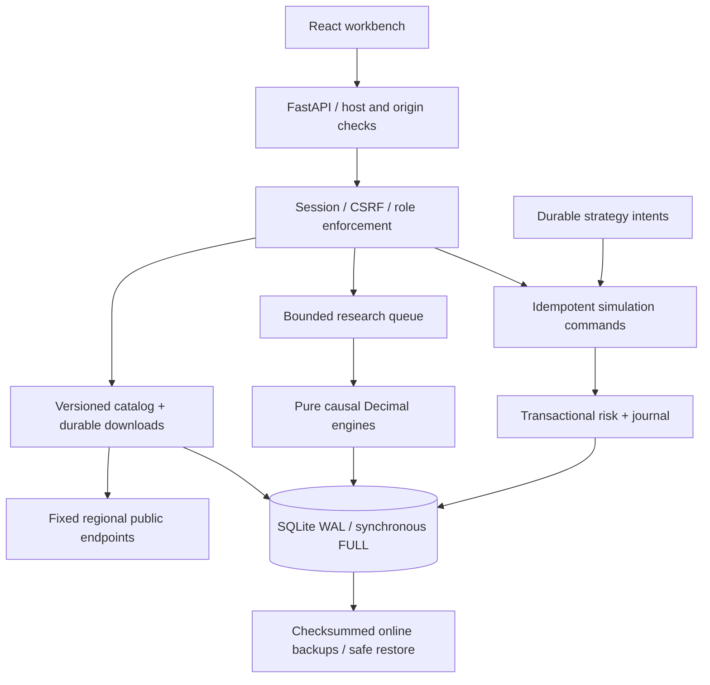

# Architecture

Tidebench is a single-workspace modular monolith for public market ingestion, reproducible research and local spot / linear USDT perpetual execution. Named users share a workspace with role-based permissions. One process owns a SQLite WAL database; a file lease enforces this boundary.

## Ownership

| Module | Owns |
|---|---|
| `market.py` | Regional HTTP transport, throttling, retries, validated spot quotes and legacy candles |
| `data_packages.py` | Atomic multi-dataset research packages, exact funding marks, cancellation fencing and immutable handoff |
| `portfolio_analytics.py` | Read-only captured exposure, isolated maintenance and price-shock settlement |
| `provenance.py` | Installed source-content identity and canonical result hashes |
| `catalog.py` | Spot/linear contract rules, history pagination, immutable datasets, import attribution, funding marks and feed health |
| `engine.py`, `derivatives.py`, `pro_research.py` | Indicators, causality, finite Decimal accounting, margin/funding/liquidation and bounded research plans |
| `pro_execution.py` | Unified accounts, inventory/margin, native asset journal, risk, reservations, funding deduplication and atomic orders |
| `pro_service.py` | Separate catalog/research tasks, forward supervision, durable reversal intents and tracked CPU work |
| `platform.py` | Passwords, sessions, users, measured request metrics and verified safe recovery |
| `pro_api.py`, `main.py` | Typed contracts, role/CSRF boundaries, maintenance admission, request IDs and static application |
| `paper.py`, `worker.py` | v0.1 API compatibility; legacy records remain distinct from professional capital |

Money is transmitted and persisted as decimal strings. Chart coordinates and display formatting can use JavaScript numbers. Core financial operations use an explicit 50-significant-digit half-even context with a finite supported domain. Any rounding adjustment in the journal is explicit; material imbalance fails closed. Contract quantities are contracts, spot quantities are base units, and prices are USDT per base asset.

## Persistence and work

Mutations use `BEGIN IMMEDIATE`, foreign keys and `synchronous=FULL`. Orders, risk checks, reservations, balances, positions, journal entries, strategy cursor and audit records commit atomically. A durable source-scoped command key deduplicates retries even during data outages; a different payload with that key is rejected. Per-market async locks serialize funding reconciliation before position changes, while transaction checks remain the economic authority.

Catalog pages commit records and cursors together. Worker tokens fence cancellation/restart races. Research captures instrument rules, dataset manifests, enriched settlement observations and tier scenarios before CPU work; replay reuses captured evidence. The engine's exported input snapshot includes the normalized inputs needed for offline reproduction. Each run records installed research-module content hashes, Python/version and Decimal context, plus a canonical result SHA-256. Replay compares the full economic result to the original result hash and fails explicitly on divergence. Research history uses materialized summaries and stable keyset pagination without decoding full result or input payloads.

Research packages allocate owned downloads in one transaction, capture missing exact-time funding marks in bounded rotating batches, and publish only after complete integrity/identity checks. A run must match the package IDs, window and manifest hash exactly; it captures the package manifest and enriched funding events for offline replay. Workspace database schema 3 adds package tables and materialized run summaries without rewriting schema-2 economic records.

Professional snapshots share a bounded, source/instrument-scoped 1.5-second single-flight cache. Cached observations keep their original trade/mark timestamps and return independent copies; the 15-second execution freshness checks still apply. Failures are never cached as synthetic data.

Catalog and research have separate background tasks, so a large download does not hold the research queue. CPU work runs in tracked threads with bounded plans; shutdown drains it before releasing the process lease. Resource limits include a research queue of ten, at most 64 cases / 20 folds / two million bar-cases, one hundred pending orders and twenty active forward strategies. Individual research windows are bounded to 98,000 selected bars plus warmup. These are explicit capacity boundaries, not a distributed scheduler.

## Execution model

The portfolio combines spot inventory and isolated linear perpetual positions. Spot trades cannot borrow or short. Perpetual P&L and funding use contract base size; margin is isolated and tiers are checked against absolute contract exposure. A shortfall becomes a recorded liability and halts new risk. Historical and forward models share signal directions but use different observations: historical next-open bars versus post-close bid/ask polling.

A reversal has durable close/open command identities under one persisted signal intent. A restart can resume an unfinished phase without duplicating a committed fill. Old intents are superseded when a newer confirmed bar is observed; historical catch-up fills are not invented. Stops are checked in each economic transaction. Limit and stop orders reserve cash and are evaluated from observed prices; matching, queue priority and partial fills are outside this local model.

## Recovery and security

Password/session controls and role checks apply to every API route. Cookie mutations require CSRF; exact hosts/origins and bounded request bodies apply before dispatch. No arbitrary provider URLs or user code are accepted. Exchange secrets are outside this product's API and storage boundary.

Recovery enters maintenance, drains requests and workers, verifies the backup, creates a safety copy and prepares a safe restored image with revoked sessions, canceled orders and halted execution before replacing workspace state. See [operations](operations.md) and [scope/evidence](commercial-readiness.md).
