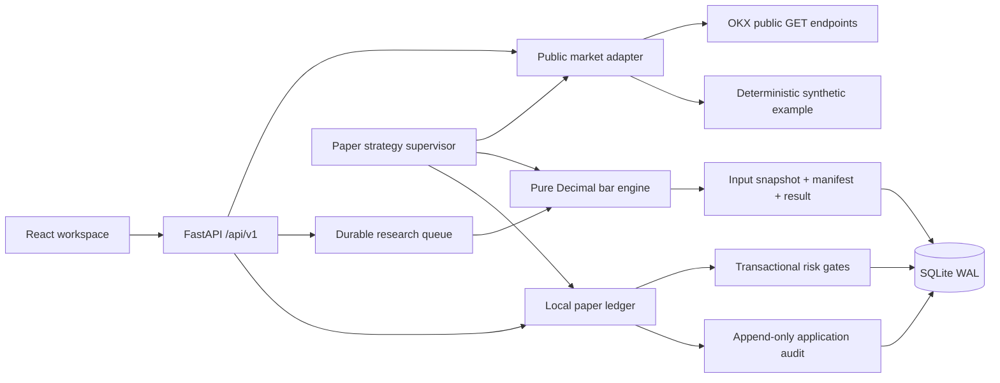

# Architecture

Tidebench v0.1 is a **single-workspace modular monolith**, not a multi-tenant execution platform. It runs one API process with a bounded research supervisor and a paper-strategy supervisor. The default listener is loopback. Exchange keys are neither needed nor accepted by the API.

## Boundaries

| Module | Responsibility | Deliberate exclusion |
|---|---|---|
| `engine.py` | Deterministic indicators, confirmed-bar replay, simulated fees/fills, equity/statistics | Network, database, user Python execution |
| `market.py` | Fixed regional OKX hosts, validation, bounded GET retries, caching, pagination, synthetic data | Private exchange APIs or order submission |
| `store.py` | Schema version, durable records, transactions, process lease | Distributed database coordination |
| `paper.py` | Atomic local fills, average-cost accounting, idempotency, risk checks | Exchange matching or realistic market impact |
| `worker.py` | Restartable saved-input research, new-bar strategy evaluation | Multi-node job scheduling |
| `main.py` | Versioned API, access boundaries, input validation, error envelopes | Account onboarding, multi-tenant authorization |

Amounts are decimal strings over the API and decimal text in storage. Python `Decimal` is used for accounting; JavaScript numbers are display/chart coordinates only. Spot base quantity, USDT quote value and fee basis are explicit.

## Correctness

The database uses WAL, foreign keys, `synchronous=FULL` and `BEGIN IMMEDIATE` for mutations. A paper command checks its durable idempotency record, risk state, account and inventory before committing the order, balance, position and audit event together. SQLite's one-writer constraint is an explicit deployment boundary, not a substitute for distributed coordination. [SQLite WAL](https://www.sqlite.org/wal.html)

A nonblocking file lease rejects a second process on the same database. Use **one Uvicorn worker**. Research jobs capture their complete normalized candle data and instrument rules before computation. A restart requeues unfinished jobs and reuses captured input. Replay starts a new run with the saved snapshot and a `replay_of` reference. Exact result reproduction assumes the same engine version; a different version is recorded and can intentionally produce different results.

Research CPU work is bounded to 2,000 bars per run and offloaded from the event loop. This is not a distributed worker service or an arbitrary-code sandbox. Shutdown waits for in-flight bounded thread work before releasing the process lease. Failed network or data validation cannot turn into a successful result.

## Forward paper strategy timing

The supervisor polls approximately every 20 seconds. It uses the latest 720 confirmed bars and the shared pure signal rules, evaluating only when the newest candle advances. A signal can fill only from an observed bid/ask quote at or after its closing timestamp. A restart does not replay missed historical fills. Stored bar cursors and permanent command keys prevent duplicate strategy fills. One running strategy per source/instrument avoids conflicting automated ownership; manual trades still share that account.

Forward paper and historical research use different execution models: **observed bid/ask after a close** versus **next-bar OHLC open**. Forward RSI warms from a rolling 720-bar window, so its initialization may differ from a longer historical run. Spread, polling delay and changing account inventory also matter. We do not promise identical fills or PnL.

Example prices have a fixed clock. An example strategy evaluates once and then waits; it is not a synthetic stream impersonating a live feed.

## Risk semantics

Limits cover per-order buy notional, post-fill per-asset exposure and loss against a day anchor. Daily baseline is the pre-fill valuation of the first accepted paper command with complete fresh marks in the observed UTC day; it is **not** a precise midnight equity or a full account-wide intraday stop. An incomplete mark on another holding does not prevent a reducing sell, but cannot establish the day anchor. Fees and adverse fill prices count toward the post-fill exposure/loss checks. Normal limits allow inventory-reducing sells. The halt switch blocks **all** new simulated fills and does not liquidate assets. Stopping a strategy retains positions. These are separate operations.

Risk state is checked inside the fill transaction. A previously committed command may be returned after a halt; that is an idempotent response, not another fill. Stale/future or malformed OKX quotes fail closed for execution. Valuation can show an explicitly stale mark, or unavailable equity if held assets cannot be marked; it never invents zero-priced holdings.

## Growing into a commercial service

Keep the pure engine and adapter contracts; replace SQLite persistence with PostgreSQL transactions, move research and execution to independently supervised workers, and add durable leases/fencing. Add workspace-scoped authorization, isolated strategy execution, credential encryption, backups, monitoring and reconciliation before adding exchange orders. The controller/executor separation in [Hummingbot V2](https://hummingbot.org/strategies/v2-strategies/) and component boundaries in [NautilusTrader](https://nautilustrader.io/docs/latest/concepts/architecture/) are useful references, not capability claims about this release.
