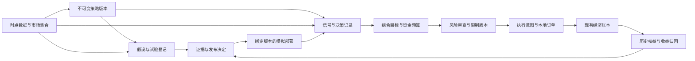

# Tidebench 深度红队审计：从可运行工作台到专业策略平台的差距

审计日期：2026-10-08。基线：`v0.3.0`，提交 `53e16cceca1f70cf47fc219d3f5c720ac7ea523c`。本轮同时修复部分已确认缺陷；下文分别记录基线、修复结果和仍未具备的能力。

## 结论

**当前产品仍是受限的单市场研究与本地模拟工作台，不能认定为完整的专业量化平台，更没有证据支持“行业顶尖”。**

已有价值集中在数据版本、可重放研究、明确的现货／线性永续单位、事务账本、权限和恢复。这些基础值得保留。但交易员最重要的工作链条——提出假设、构建组合、控制研究选择偏差、发布策略版本、解释每次决策、持续归因与处理异常——尚未连通。上一轮把工程验收覆盖和产品成熟度联系得过于紧密，应当修正。

“服务能启动”“测试通过”“界面有对应标签”“模型可重放”各自只能证明有限事实。它们不能替代策略表达能力、组合语义、数据适用性与真实日常工作流的验收。本报告不会用一个主观评分掩盖这些差别。

本次评估继续遵守已选范围：公开真实行情、回测、本地模拟，现货与 USDT 线性永续。不把缺少实盘下单列为当前范围缺陷，也不使用交易所私钥。

## 方法与证据强度

检查了策略输入、信号实现、研究计划、前向监督器、模拟账本、数据目录、部署接口、前端表单、运行监控和已有验收范围。对危险假设执行隔离复现，使用真实 SQLite、真实运行时和真实经济账本，只在行情／历史传输边界注入合成数据或延迟。额外对实际数据目录和研究引擎测量存储／结果体积。没有访问用户账户，也没有发送交易所请求。

- **R：复现事实。** 有执行结果，仍受所用输入、时间窗口和故障边界约束。
- **C：代码及接口事实。** 可以定位缺失字段、分支或连接；不等于已经测量全部运行后果。
- **D：设计判断。** 根据目标用户任务提出的要求；不是已经完成的用户访谈或外部认证。

P1 表示必须优先解决的模拟执行正确性或重要工作流缺陷；P2 表示容量、诊断或能力限制。本次未证明 P0 级真实资金事故。策略能力缺失另列为产品阻断项，不把未实现的功能全部伪装成程序漏洞。

证据：基线 [JSON](v0.3.0-baseline.json)、本轮修复后 [JSON](post-fix-observations.json)、离线 [复现程序](../../scripts/redteam_audit.py)。程序报告观察值，不以正常退出冒充“专业平台验收通过”。修复后的程序可在当前 checkout 运行；历史基线 JSON 保留当时观察，不应被新代码重新生成覆盖。

```bash
uv run python scripts/redteam_audit.py
```

## 一、确认的问题及本轮处置

| ID | 级别／证据 | v0.3.0 基线事实 | 本轮结果 |
|---|---|---|---|
| RT-01 | P1／R+C | 历史请求挂起 6 秒，超过正常 5 秒轮询间隔；新的行情读取为 0，同市场保护性止损仍 pending，工作任务却存活 | 已修复此故障路径；同样挂起 6 秒，读取继续，止损 filled |
| RT-02 | P1／R | 手动多仓 100 张，启动 short-only 策略后被平仓并开成空头 1,000 张；无明确接管配置 | 启动事务拒绝已有仓位，原 100 张保留；没有自动平仓或隐式接管 |
| RT-03 | P1／R | 策略启动前的手动限价单，能在策略取得市场后成交并改变其库存 | 启动事务拒绝该市场已有挂单；保留原挂单及资金预留，需用户显式取消 |
| RT-04 | P2／R+C | 5 个相邻滑窗，每次 2,000 根，目录实际存 10,000 条，只有 2,004 个不同时间戳 | 未修复；前向状态仍借用完整不可变研究快照 |
| RT-05 | P1 工作流／R+C | OOS API 支持候选参数，但前端训练／测试和滚动模式没有传 `grid`；默认实际只评估 1 个候选 | 已补显式“固定参数／仅在训练集选择”；浏览器真实提交 2 个候选并验证训练结果有 2 项 |
| RT-06 | P2 能力／R+C | Example 使用固定时钟，连续评估历史任务数为 `[1,1]`，无法体验持续演进的策略生命周期 | 未修复；这是已披露的示例设计限制 |
| RT-07 | P2／R+C | 3 个持仓市场，逐市场调用刷新时产生 9 次逻辑行情分发 | 未修复；不能将 9 次逻辑调用写成 9 次实测交易所 HTTP 请求，1.5 秒缓存会合并快速重复 |
| RT-08 | P2／R+C | 4 候选 × 240 根的完整研究 JSON 为 751,615 字节，输入／结果数组随候选重复 | 未修复；未在最大预算下注入或证明 OOM |
| RT-09 | 产品阻断／R+C | 策略类型仅接受 `sma_cross`、`rsi_reversion`、`buy_hold` | 未补新策略；名称扩展不能代替所需的数据与组合模型 |
| RT-10 | P1／R+C | 合法用户名 `pending-order`、`risk-engine` 被当作内部执行身份，能绕过策略市场的手动新增风险限制 | 已移除用户名特殊权限；两种名字均被拒绝，内部挂单／清算依据内部调用参数 |

### RT-01：不是“再加一个异步任务”就足够

基线将风险、清算、挂单和策略评估放在同一个循环。更严重的是，策略下载完整历史时一直持有市场经济锁。仅把策略移到另一个任务，同市场止损仍会被那把锁卡住。

本轮同时分开了策略监督与执行轮询，并把历史准备移出市场经济锁，用部署锁串行化同一策略的重复评估；经济阶段重新检查策略是否仍运行。策略评估最多 4 个并行、每次 60 秒截止，停止／恢复／关机时取消并收拢子任务。已有每笔成交内的停止检查、持久 close/open 幂等身份继续保留。新增测试覆盖挂起历史时同市场保护性止损、并发同信号只准备与成交一次、停止等待任务后监督器继续运行。

**剩余问题：** 行情和资金费对账仍涉及经济锁内 I/O；每市场轮询仍串行，监控主要看任务存活。此次证据只证明历史下载耦合被解除，不证明任意供应商故障都已隔离，也没有获得执行延迟 SLO。[基线监督器](https://github.com/billpwchan/tidebench/blob/53e16cceca1f70cf47fc219d3f5c720ac7ea523c/backend/tidebench/pro_service.py#L815)

### RT-02／03：净仓位账本没有自动给出策略所有权

一个市场只有一个净仓位，可以是一种合理限制；但“该仓位归谁管理”仍需明确。原实现禁止策略运行后的手动加仓，却允许启动时直接接管原持仓、遗留挂单随后改变仓位，规则不闭合。

本轮选择可验证的平仓启动政策：该来源／市场必须无仓位、无挂单，检查与创建部署在同一写事务内完成。前端说明这一条件。不偷偷清仓、不自动撤保护单、不加入未经设计的接管开关。未来需要接管功能时，应先展示捕获的库存／订单、预期操作与风险，再将明确决定绑定到策略版本和账本修订。当前修复没有实现多策略虚拟子账本。[基线部署入口](https://github.com/billpwchan/tidebench/blob/53e16cceca1f70cf47fc219d3f5c720ac7ea523c/backend/tidebench/pro_service.py#L620)

### RT-04／08：资源上限不等于资源成本已经合理

当前每个新前向 bar 下载 2,000 根并保留完整目录版本。目录版本不可变本身有价值，问题在于将每次增量计算都当成新的完整研究采集。实验记录重复不代表数据损坏，但它不是合适的长期运行状态模型。

需要将增量行情／滚动指标状态与研究快照分开：去重的序列存储、确定的历史修订规则、信号引用数据版本／范围，按保留政策保存必要快照。研究结果应共享内容寻址的输入，候选摘要与大明细分离，实际字节、内存与 CPU 预算参与任务准入。当前 JSON 测量仅说明重复成本，不能线性外推成已测容量或云端性能。[基线前向采集](https://github.com/billpwchan/tidebench/blob/53e16cceca1f70cf47fc219d3f5c720ac7ea523c/backend/tidebench/pro_service.py#L700)

### RT-05：存在 OOS 引擎，不等于用户能完成 OOS 选参

后端训练内选参原来已经存在；问题是界面没有送入候选集。固定假设的 OOS 测试本身完全有效，不应因为只有一个候选就判为“错误回测”。缺陷在于 UI 缺少有意选择两种研究任务的路径。本轮将两者分开，默认继续固定参数，用户明确选择后才传候选网格；测试集不参与候选排序。候选集选择控件在 walk-forward 中也可用。[基线表单](https://github.com/billpwchan/tidebench/blob/53e16cceca1f70cf47fc219d3f5c720ac7ea523c/frontend/src/pages/ProResearch.tsx#L288)

### RT-10：显示名称不能成为权限凭据

该问题发生在本地模拟的库存所有权控制，不能描述成可盗取交易所资金或绕过所有角色权限。根因仍然严重：用户名字符串和可信内部调用身份混用。此次去除两个名称的豁免。下一阶段应把用户身份、策略身份、内部命令类型分别建模，避免更多“魔法字符串”扩散。[基线成交入口](https://github.com/billpwchan/tidebench/blob/53e16cceca1f70cf47fc219d3f5c720ac7ea523c/backend/tidebench/pro_execution.py#L651)

## 二、交易员一天的工作，当前能完成多少

下表来自接口和代码审查，是任务适配判断，不冒充实测用户访谈。

| 真实任务 | 当前程度 | 阻断在哪里 |
|---|---|---|
| 取得某个现货／永续的完整可追溯研究输入 | 已有明确路径 | 更长历史仍受供应商覆盖及导入证据约束 |
| 检查一个参考规则、费用与独立 OOS 折 | 已有路径，本轮修复选参入口 | 候选评价目标固定；研究尝试之间无防反复试测试集的治理 |
| 研究当时可交易的 20 个币种，保留退市样本 | 不能完整完成 | 当前在售规则，不是 point-in-time universe／历史规则日历 |
| 对 20 个市场做相对强弱排序、统一再平衡 | 不能 | `ResearchInput.dataset_id` 为单值，引擎一次接收一个 instrument |
| 研究现货—永续资金费套利 | 不能 | 两腿共同资金、保证金、对冲误差、时点可得信号与非原子成交均缺失 |
| 自定义策略并发布可复现版本 | 不能 | 无策略 SDK／注册表／依赖与能力声明；只接受 3 个固定 kind |
| 为策略设风险预算、止损、追踪退出、时间退出 | 不完整 | 独立手动止损单不等于回测和前向共享的策略退出政策 |
| 将获批研究版本原样发布到模拟 | 断开 | 部署未绑定研究 run／选中候选／策略版本／风险修订，依靠重新输入参数 |
| 同一 BTC 市场运行多个 alpha 并核对归因 | 不能 | 单市场唯一运行策略、单净仓位；无虚拟策略账本／组合净额分配 |
| 解释今天某笔订单为什么下、用了哪个数据版本 | 部分 | 有 actor、行情时间与风险快照，但 forward intent 缺完整特征／历史数据版本链 |
| 查看策略净值、组合回撤、资金流与收益来源 | 不完整 | 回测有权益明细；持久前向账户缺策略／组合历史权益与归因序列 |
| 断线后知道该停止研究、禁止加仓还是仅估值降级 | 部分 | 有新鲜度拒绝与错误显示；无完整能力降级矩阵、心跳截止和事件处置闭环 |
| 回滚策略版本、比较前后偏差、保留历史关系 | 不能 | 只有部署启动／停止，缺版本发布／回滚模型 |
| 小团队共享研究、权限与恢复 | 有基础 | 共享工作区，不是独立资金账户／组织治理或租户隔离 |
| 多周持续运行并证明增长／延迟／恢复目标 | 尚无证据 | 现有短负载与 48h 公共数据窗口不覆盖这种工作负载 |

最需要补的不是更多导航项，而是用户在这些任务中反复丢失的对象：**策略版本、研究假设、投资组合、决策证据和发布关系。**

## 三、现有策略为什么仍像 Demo

### 三个参考规则不是可供交易员直接选用的 alpha 库

SMA 是方向规则，RSI 是单指标的状态规则，买入持有是重要基准。它们适合验证计算、成本和账户模型，不能因此获得经验证的交易优势。当前缺少策略适用条件、市场状态过滤、波动率风险定仓、退出政策、容量限制、失效条件和发布证据。把 RSI 包装成“智能均值回归”不会改变这一点。

现有参数搜索按训练总收益排序，回撤和 ID 只作后续排序条件。这会回答“在给定样本及模型内哪组收益最大”，并没有回答“是否足够稳定、可执行、值得进入下一阶段”。应由研究假设预先声明目标、最低有效交易证据、风险约束、基准、成本假设和否决条件，而不是看见结果后选择指标。

已有独立测试折与因果性检查值得保留，但用户可以跨多个 run 反复查看测试集再修改策略。单个 run 的 train-only 代码正确，不会自动解决跨 run 的研究者选择偏差。需要尝试登记、冻结的最终保留集、访问记录，以及与样本长度和试验相关性相适应的统计分析。PBO 论文讨论了大量策略尝试带来的假阳性；不能把增加一个 PBO／Sharpe 数字当成盈利认证。[Bailey 等：The Probability of Backtest Overfitting](https://www.davidhbailey.com/dhbpapers/backtest-prob.pdf)

### 策略体系应按经济逻辑与执行需求建立

以下是开发与验收分类，均为研究参考方向，不是投资推荐，也不是已经实现的功能。

| 策略家族 | 专业实现所需内容 | 当前缺口与验收重点 |
|---|---|---|
| 基准 | 买入持有、现金、固定组合基准、统一成本口径 | 保留现有单市场买入持有；补组合及 benchmark 版本 |
| 时间序列趋势 | 突破／趋势信号、波动率定仓、明确退出与再入场规则 | 先贯通版本与退出模型；检验不同市场／状态、参数邻域和费用变化 |
| 有条件均值回归 | 状态过滤、入场／退出、止损、最大持有期、流动性限制 | 不能仅在 RSI 上加几个阈值；需解释哪些状态禁止交易 |
| 横截面动量／因子 | 当时可交易集合、同步多市场、排名、权重、再平衡、成本／换手约束 | 当前单 instrument 引擎无法表达；需要组合目标层 |
| 资金费／基差研究 | 两腿资金和抵押品、决策时已发布信息、资金费现金流、对冲与非原子成交风险 | 已结算资金费可作成本记录，不能直接充当过去决策时已知的预测信号 |
| 配对／统计套利 | 配对形成期、参数估计冻结、对齐、残差定义、两腿成交与失效管理 | 需要多资产事件与组合账本，防止用全样本挑配对或估计对冲比率 |
| 做市／盘口策略 | L2／成交事件、序列修复、队列／部分成交、库存与延迟模型 | 当前 OHLCV／REST／全额成交不能支持可信结论，不应挂个策略名字就对外提供 |

每个可发布策略版本至少需携带：经济假设、输入与时点语义、参数 schema、warmup／状态恢复、仓位和退出政策、费用与执行模型、基准、风险边界、测试及研究结果、失效诊断。不要求每一种策略都塞进相同模板；应允许事件式进出场和组合再平衡两类表达。

可借鉴 LEAN 将选币、信号、组合目标、风险和执行分开。其文档也明确说明默认框架不适合所有紧密耦合的技术进出场策略；因此这里采纳职责边界，并不照搬默认分配模型。[QuantConnect Algorithm Framework](https://www.quantconnect.com/docs/v2/writing-algorithms/algorithm-framework/overview)

## 四、研究正确性还缺哪些防线

1. **时点可得性。** 为数据区分市场事件时间、采集时间、当时可得时间与修订版本。多周期合并只能使用已结束／已发布数据，不能仅按相同 timestamp 合并。当前资金费历史适合已实现费用记账，不自动提供历史预测信息。
2. **市场集合与规则。** 历史研究不能默认今天仍在售的币就是过去的完整集合。需要上市／退市时间、历史合约与精度规则、当时的可交易状态；缺失时明确降低结论适用范围。当前维持保证金档位被正确标为当前情景，仍不能当作历史档位。
3. **策略与指标的状态一致性。** 同一版本在整段回测、分块回放、增量前向、重启后恢复应产生可比较的决策链。当前共享方向函数是一项基础，不是对所有 warmup、滚动重算和缺失 bar 情况的一致性证明。
4. **用户策略因果性。** 未来 SDK 要提供前缀／未来扰动、跨周期可得性和切片比较的检查。不能允许 API 进程直接执行任意 Python，再靠提示要求用户不要写未来函数。Freqtrade 的自动切片比较提供了一种可参考的方法，也有覆盖边界。[Freqtrade lookahead-analysis](https://www.freqtrade.io/en/stable/lookahead-analysis/)
5. **模型精度按任务选。** 对慢周期假设可使用披露的 bar 模型；对盘口、配对腿风险或盘中止损敏感假设，需要更细事件或至少上下界／路径敏感性分析。NautilusTrader 文档区分 bar、tick、订单簿数据粒度及对应回测模型，说明应根据问题选择数据，而非用一个 OHLCV 引擎包装所有策略。[NautilusTrader Backtesting](https://nautilustrader.io/docs/latest/concepts/backtesting/)
6. **多次研究的治理。** 记录失败与放弃的试验、预先冻结的目标、研究者看过哪些保留集。独立折从空仓开始的现有语义清楚，不应偷偷拼成连续组合净值；如果新增连续 walk-forward，就要独立建模换参、承接库存和切换成本。

## 五、应重构的领域边界

不建议推倒已验证的账本，也不建议先靠微服务、Kubernetes 或更换数据库证明“专业”。先把经济对象与契约定义正确，再用真实负载决定部署拓扑。



这是建议目标，图中尚未实现的对象不能作为当前架构能力宣传。

| 对象 | 应保持的契约 | 与当前实现的关系 |
|---|---|---|
| `StrategyVersion` | 内容／依赖身份、参数 schema、输入能力、warmup、状态版本与风险／退出政策 | 新增注册表；替代不断扩大的 kind 分支 |
| `Study`／`Trial` | 假设、目标、数据版本、试验关系、候选集、保留集规则和失败记录 | 扩展现有 immutable run，保留 replay/hash |
| `DeploymentRevision` | 明确绑定策略、候选与研究证据、执行模型、资本预算、风险版本和创建者决定 | 当前部署只有重新输入的配置，需真正连接研究 |
| `DecisionRecord` | 所见数据范围／版本、特征、目标、否决理由、状态前后、实际订单关系 | 扩展当前 intent，而非仅存目标与完成状态 |
| `PortfolioTarget` | 多市场共同预算、约束、再平衡、净额分配与冲突政策 | 当前 available-cash 分配不是组合优化或资本分账 |
| `Accounting`／`Attribution` | 经济净仓与策略虚拟份额分开核对，费用／资金费／现金流归属可追踪 | 保留真实账本，新增策略归因与历史序列 |
| `RuntimeHealth` | 任务进度、截止时间、数据新鲜度、能力降级与可处置告警 | 现有存活检查／错误列表不够 |

自研引擎与接入成熟引擎都需评估。应以同一批事件／成本／资金费／强平／重启用例做差分验证，比较维护成本、许可和模型适配，而非因为已经写了代码就继续无限扩张。无论选择哪种，Tidebench 的输入证据、策略发布链、账本核对与交易员界面都可以继续成为独立价值。

## 六、前端为什么仍缺专业感

问题主要来自工作对象和决策路径缺失，增加图表密度或描边层级无法解决。

- **研究对象不完整。** 当前从 dataset／mode 起步；交易员更需要从假设与策略版本进入，看到输入要求、试验关系、未解决问题和下一步。保留高级数据入口，但不要迫使每次工作都从数据 ID 重新装配。
- **研究到执行断开。** 结果应能生成带版本、成本模型、资本、风险、库存政策和差异预览的模拟发布单。当前页面没有把选中研究结果绑定到部署，不能把两个页面相邻称作完成交接。
- **状态不足以指导处置。** running／failed 不能回答“最后哪个 bar 已处理、下一次应何时处理、为何未下单、数据过旧还是资金费未到、现在允许哪些操作”。需要决策时间线和按原因组织的行动。
- **缺组合绩效与归因。** 当前敞口和静态压力有价值；不能替代历史净值、drawdown、策略贡献、费用／资金费来源、资金流调整和基准差异。
- **示例不能演练工作。** Example 应能暂停／步进／加速，观察趋势反转、资金费到期、缺数据和风险暂停。固定一刻的漂亮数字不够。

视觉继续用留白、对齐、克制配色与排版；主视图由真实任务决定。策略工作台、研究结果、组合绩效和事件处置是应补的内容，不是四个空壳导航。键盘路径、可访问性、长表、错误恢复、中文信息密度仍需任务级验证。

## 七、下一轮以什么标准验收

下面是建议的工程／产品验收目标，**当前尚未通过**；不是已经观察到的业界统一阈值，也不是盈利保证。

| 顺序 | 交付目标 | 可判定的完成条件 |
|---|---|---|
| 1 | 执行隔离与可诊断性 | 历史、报价、资金费分别注入慢／错／缺失；应继续的市场和操作继续，不允许的操作有明确原因；进度截止可被监控识别；关闭／恢复无遗留经济任务 |
| 2 | 策略版本与研究发布链 | 从一个保存候选生成部署修订；参数、输入、代码、执行与风险差异可见；版本不可改写；停止、重启和回滚可追踪；拒绝隐式接管 |
| 3 | 策略表达与状态 | 至少贯通趋势与有条件均值回归的完整定仓／退出政策；同一输入在整段、分块、前向及重启后产生规定的一致决策；失败案例可解释 |
| 4 | 多资产组合 | 对 20 个明确来源／覆盖的市场完成同步研究、统一预算与再平衡；不足数据、退市、最小下单、净额冲突、多个信号同时到来都有定义和测试 |
| 5 | 研究治理 | 试验登记、预声明目标／约束、保留集访问关系、参数邻域／成本稳定性、基准和不确定性；选参不能默默改用测试表现 |
| 6 | 长期状态与规模 | 增量序列去重，候选共享输入；测量存储增长和实际资源；压力超过预算时拒绝／排队，不能把 API 主进程拖死 |
| 7 | 真实日常工作流 | 在干净环境完成“假设→版本→研究→证据审查→模拟发布→解释决策→异常处置→归因→回滚”；不靠手工重输已确定参数、不靠直接改数据库 |
| 8 | 持续运行证据 | 为上述目标负载先定义延迟／数据年龄／恢复与存储预算，再记录至少 7 天工程 soak 及其故障演练；它仍不等于月度可靠性或策略经济有效性证明 |
| 9 | 商业运行环境 | 实际主机完成 TLS、外部备份与从备份恢复、告警送达与处置、升级回滚；共享团队版与托管多租户版分别验证权限边界 |

第 8 项的七天是拟定的工程观察窗口，不能用缩短 sleep 的模拟来声称已完成。可以立即实现采集与验收工具，但真实经过的时间、外部运行环境和用户研究结果应据实记录。

## 八、已经挑战并排除的误报

- 清算公式重读括号后符合现有定义：维持保证金加费用储备；没有将其报成财务计算漏洞。
- 同一来源／市场已有唯一运行策略约束；没有声称任意多个活动策略能同时争抢同一净仓。
- 分配字段明确表示“入场时可用现金比例”，不是原始总资产权重。先后两个 50% 得到不同原始资金份额，是该语义结果；缺少共同组合预算仍是独立能力限制。
- 当前已经实现因果回测、独立 OOS 和严格 replay；没有因为高级治理缺失就抹掉这些能力。
- 没有发送实盘订单符合授权范围，不是本次产品失败的理由。

## 九、本轮验证与仍未证明的事

本轮完整后端检查：**466 项通过**；Ruff 检查和格式通过；TypeScript／生产构建通过；**8 条桌面／移动 Chromium 流程通过**。其中 OOS 表单的真实浏览器提交验证两个训练候选，新增运行时测试覆盖前述隔离、所有权、幂等与停止路径。离线红队脚本分别保留修复前后观察。

现有 24 × 1,000 bar 的混合负载验证研究与读取并行时的局部行为，不能证明最大研究容量、20 个市场多周运行或供应商长时间故障下的 SLO。先前 48h OKX 公开数据验收只证明该次窗口和端点；没有制造用户访谈、盈利历史、外部审计、长期可用性或数据再分发权利。

本报告应成为后续实现的验收依据，而不是把待完成事项换一种写法继续称为“已经 prod-ready”。
