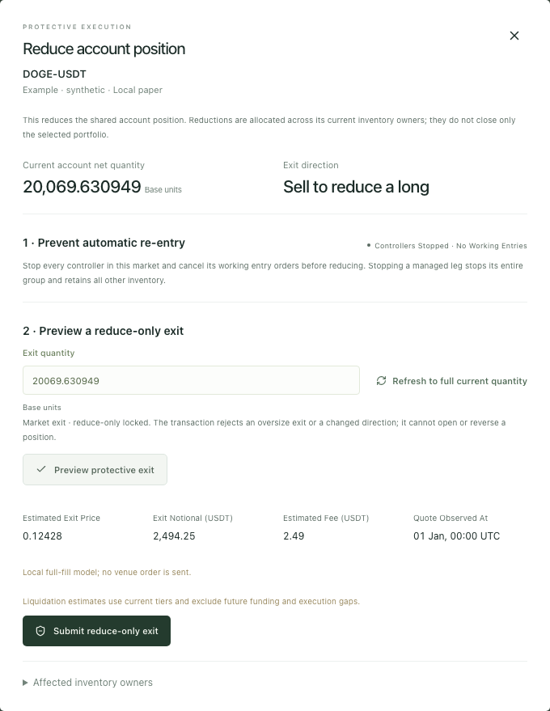

# Operate a reviewed paper account

Tidebench v0.11 connects native inventory protection, full-account capital review and recoverable research/forward evidence. Read the [v0.10 economic workflow](professional-workflows-v0.10.md) for shared capital, causal lifecycle, deferred settlement and sequential portfolio contracts. This update fixes independently reproduced operational and selection defects; it does not certify investment edge.

## Protect actual account inventory

Open **Overview → Positions** or **Execution → Positions** and choose **Reduce account position**. A managed group's inventory view also provides this action for its verified nonzero ownership. The action targets the **account net position**. Its disclosure and owner evidence explain that reductions allocate across current owners; it is not a close of only one portfolio sleeve.

The dialog captures source, instrument, side, generation and the exact native quantity. Spot quantity is base units; perpetual quantity is contracts. A long exits by selling and a short by buying. Reduce-only is locked.

1. **Stop controllers and cancel entries** actually stops every running controller in that market and cancels its pending entry orders. A managed-leg stop stops the whole group while preserving all other inventory. Failures remain visible and prevent progression.
2. **Preview protective exit** uses the account cost/risk model. Current quantity changes invalidate the review; refresh the quantity and preview again. Estimated cash, margin release, fees and insurance debt use the same pure financial projection as a committed fill.
3. **Submit reduce-only exit** rereads account inventory, controllers and orders. It refuses changed position identity or active automatic entry. Identical retries retain the command key. The receipt shows the actual fill and remaining account position. New automatic exposure requires an explicit new deployment.

Protection is available during a funding publication or schedule gap. Fresh usable execution quotes and backend reduce-only transaction guards still apply. An independent operator can explicitly start another controller; this workflow does not assert an account-wide distributed lock.

## Keep pending stops attached to their position

A pending reduce-only limit/stop binds the original position generation. If another reduction shrinks that same inventory, the trigger fills the remaining reducible amount and cancels the remainder. **Requested / filled / canceled** are distinct in order history, and the original command payload/key/receipt identity remain recoverable. Once the original position is flat, reversed or replaced, its dependent protection cancels. It cannot reduce a reopened position. Legacy pending protection without a bound identity cancels with an explicit reason.

This is the named local model `position_bound_reduce_only_clip_v1`. It has full simulated fills and uses the existing trigger-price model; it is not venue matching, partial-fill fidelity or every OKX TP/SL price mode. OKX's [position TP/SL guide](https://www.okx.com/en-gb/help/how-do-i-modify-take-profit-tp-and-stop-loss-sl) motivates tying dependent protection to remaining original inventory; source behavior is not silently asserted as our execution implementation.

## Read complete economics before adding risk

A fresh ticker or mark cannot establish that a funding schedule is current. Perpetual additions independently require source/instrument identity, a timestamp no older than 180 seconds (at most five seconds ahead), ordered settlement boundaries and a future boundary. Existing inventory with an unknown schedule retains marked margin details but has provisional equity; new risk and linked forward returns remain unavailable. This local admission policy is explicitly different from venue acceptance. See [OKX's funding channel fields](https://app.okx.com/docs-v5/en/#public-data-websocket-funding-rate-channel).

Actual OKX tier responses can report `1000` followed by `1000.01` when the native lot is `0.01`. The catalog retains the complete source record and maps only an exactly adjacent native-lot bound to the local `(min,max]` convention. Larger gaps, overlaps, non-grid intermediate bounds, duplicate tiers and decreasing maintenance rates are refused. Finite maximum tier coverage still applies. Captured existing research keeps its own frozen tier assumptions.

**Review portfolio release** shows bound research metrics, chronological windows and the predeclared rejection assessment above approval. Effective capital shows the captured equity denominator, existing use, the proposed total, remaining budget/excess and each owner. Manual and working-order exposure count; each owner's actual and promised use take their maximum. Headroom is not available cash. Read time can change without invalidating identical economics; actual equity/ownership/policy changes require a new review.

Historical group inventory uses verified group owner quantities, with account net inventory and current owners shown separately. A terminated flat group cannot inherit a new manual position simply because the symbol matches. Unverifiable ownership stays unknown; missing monetary valuation does not erase verified native quantities.

## Select and recover evidence

**Research governance** retains admitted single-strategy attempts through an older restore even when their artifacts are missing. Replays remain distinct from primary experiments. **Review paper release** identifies a completed-fold choice after test exposure and requires a specific acknowledgement; selecting the best visible test outcome is not independent final evidence.

**Execution → Forward performance** resolves paired UTC observation times to a fixed account window. The acceptance table shows actual values and requirements. Save a report, reopen it after reload and separately verify its exact pinned inputs. Empty time ranges stay empty. Stored content checks do not masquerade as full recomputation. [Calculation and snapshot API](forward-evidence.md).

The public research battery includes all declared parameter neighbors and both cost assumptions. Its adverse results remain published; this workflow does not approve a strategy because it has a page, a backtest or a paper release. [Risk methodology](portfolio-risk-research.md), [independent before/after review](audit/red-team-0.11.0.zh-CN.md), [verification scope](verification.md).
