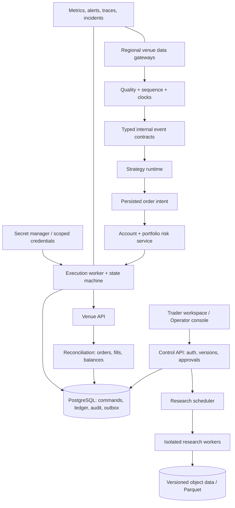
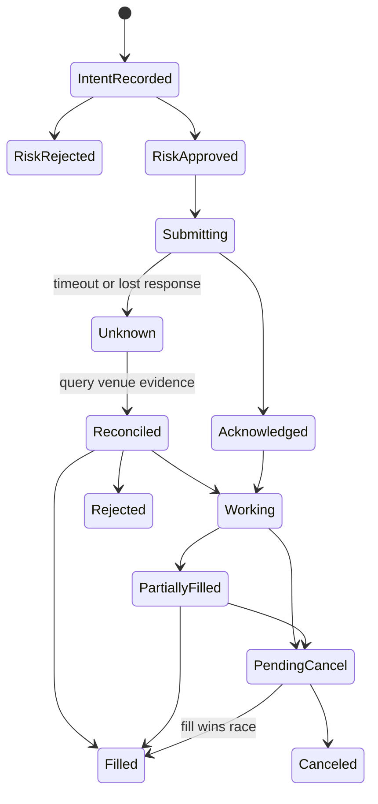

# 面向交易员的产品规格与商业目标架构

本文是升级前的目标规格，保留设计动机及超出现阶段范围的托管／实盘目标。v0.2 中已实现的公共数据、研究、模拟账本、权限和恢复能力见[当前架构](architecture.md)与[验收记录](verification.md)；下文以 v0.1 为基线的状态说明不代表 v0.2 仍未实现。

状态：设计规格。除特别注明 v0.1 已实现的能力外，本文描述的是后续目标，不能作为当前产品功能清单。日期：2026-10-08。

## 一、核心用户与真实操作场景

默认核心用户是独立系统化交易员、研究员及小型自营团队；不是首次买币的消费者，也不是争夺微秒延迟的 HFT 团队。先选择这个群体，才能合理确定数据粒度、操作密度与正确性要求。

| 角色 | 主要任务 | 需要回答的问题 | 不可接受的失败 |
|---|---|---|---|
| 系统化交易员 | 研究假设、部署、监视与调整风险 | 这个策略当前为何持仓？哪些参数、数据和成本支撑判断？ | 参数改动与运行版本混淆；纸面与实盘环境混淆 |
| 量化研究员 | 数据筛选、实验、稳健性与样本外检验 | 改变成本和样本后结论是否仍成立？另一个人能否复现？ | 数据修订不可见；多重筛选后只展示最佳回测 |
| 组合负责人 | 分配风险预算、查看总敞口与资金归因 | 不同策略是否共同押注同一风险？现金和可用保证金是否足够？ | 策略各自合规但账户整体超限；无法解释净值变化 |
| 风控与运营 | 停止新增风险、处理异常、恢复与对账 | 哪些状态可信？哪里存在未决订单？恢复后能否继续？ | 把 ACK 当成交；宕机后盲目重下；停止后继续发单 |

小团队可以由同一人兼任多个角色；产品仍要保留这些职责的概念边界。现阶段不假装已经做过用户访谈。后续至少分别观察研究员与执行操作员完成真实任务，验证信息架构，而不是只让他们评价截图是否好看。

## 二、交易员的一天应如何贯通

**开盘前/接班。** 先看系统状态、数据延迟、未决订单、余额对账、策略版本及风险预算变更。不能先展示收益榜，再把数据异常藏在设置页。Crypto 全天交易，因此“会话”由组织策略定义；所有原始事件保留 UTC，展示时区只是视图偏好。

**研究。** 选择市场、数据期间与适用交易规则；定义因果信号和成交模型；保存实验而非覆盖配置。研究结果包括相同区间的基准、成本、成交与未成交原因、开放仓位、数据质量、持仓时间和样本限制。参数搜索要记录尝试次数；样本外与成本压力检验必须在选出最佳参数之前设计。

**部署。** 策略版本、参数、资金、交易环境、风险政策、数据依赖形成不可变 deployment revision。界面先展示“将运行什么、使用什么资金、何时停止”，再允许启动。改变参数创建新 revision；明确是否继承持仓与订单。首版仅在本地模拟环境验证这条交互链。

**盘中。** 总览聚焦“当前需要动作的事”：数据断层、拒单、风险预算、未决执行和策略停滞。详情页关联 signal → intent → risk decision → order event → fill → ledger posting。不能只有一个最终 PnL 数字。

**复盘。** 按策略、资产和执行原因拆分收益与成本；比较模型成交价与观察成交价；查看风险拒绝是否符合政策。导出包含版本与假设，避免复制一张无法验证的曲线。

**事故。** 操作员能区分暂停策略、停止新增风险、撤销挂单与减仓。每种动作有独立语义、权限和审计。界面必须直接显示系统仍不知道什么，而不是用“已连接”覆盖未知订单状态。

## 三、产品域模型

目标域以以下对象为中心，而不是以页面或数据库表为中心：

`Workspace → VenueAccount → Portfolio → RiskBudget → StrategyVersion → DeploymentRevision`

研究域：`DatasetVersion / Experiment / RunManifest / ResultArtifact / ValidationReport`。

执行域：`Decision / OrderIntent / RiskDecision / Command / VenueOrder / OrderEvent / Fill / LedgerPosting / ReconciliationRun`。

每个对象有稳定 ID；事件包含 event time、received time、sequence/版本、source、correlation ID 和环境。金额和数量带资产/单位，instrument metadata 带生效时间。不可把 BTC 数量、USDT 名义金额、合约张数和 USD 估值混成一个 `amount`。

**研究版本不能等同于最新策略代码。** 数据、参数、代码/engine 版本、执行模型与 instrument snapshot 都参与 run identity。数据哈希表示本次输入一致性，不自动证明交易所数据真实或完整。v0.1 已保存这条链路的受限现货版本；完整代码工件和大型数据目录是后续工作。

## 四、目标架构：控制面与交易运行时

这张图表示故障和数据 ownership 边界，不意味着第一天部署十个微服务。控制 API、目录、研究编排可以先保持模块化单体；运行用户代码、私有凭据、CPU 密集研究和真实交易执行应在边界成熟时隔离。只有实测容量、风险隔离或团队职责要求出现，才引入独立消息基础设施。Kafka、Redis、Kubernetes 都不是专业性的替代品。

**推荐演进路径：** 现有受限 pure engine 与端口契约 → PostgreSQL/对象数据目录 → 独立研究 worker 与受控 SDK → 正式版本交易引擎/执行适配器评估 → Demo 状态恢复与对账 → 组织权限与运营试点。避免一边扩展实盘，一边临时重写账本和租户隔离。

成熟系统将执行、风控、组合与对账作为不同职责。[NautilusTrader 的执行概念](https://nautilustrader.io/docs/latest/concepts/execution/) 可用于评估正式版本引擎集成；目标不是照搬类名，而是保留命令、风险批准和 venue evidence 的边界。

## 五、数据与研究的专业要求

1. **时间。** 原始数据保存交易所 event time 与本地 receive time；策略读取点必须有明确 availability time。高周期 K 线完成之前不能供低周期策略看到其最终 close。
2. **质量。** 重复、乱序、时钟跳变、缺口、未完成 K 线、instrument 停牌与规则变更分别编码。连接存活、价格新鲜和序列完整是不同健康信号。
3. **版本。** 历史数据落不可变分片并建立 manifest；补数或交易所修订生成新版本。对比 run 时说明是否使用相同输入。
4. **粒度。** OHLCV 只支持声明过的 bar 模型。限价排队、盘口冲击、intrabar stop/target 先后和部分成交需要更高粒度的数据与模型，不能由一根 candle 推断。
5. **验证。** prefix replay、未来扰动、固定小序列、ledger 重放、费用压力与样本外检验分别证明不同事情，不能用一个“backtest passed”覆盖。
6. **指标。** 明确权益采样、估值资产、基准、成本和样本区间。未来支持 turnover、exposure、holding time、profit factor、MAE/MFE 时，必须先定义闭合交易及未平仓处理；不把 fills 数直接叫 round-trip trades。

研究界面应能够点击一个成交，定位其信号 K 线、当时特征、订单约束与费用。这是长期产品的关键交互验收；v0.1 提供流水与模型说明，逐笔 feature snapshot 和完整归因是后续能力。

## 六、组合账本与风险模型

商业目标采用逐资产复式账本，余额、冻结额、交易成本、手续费资产、资金划转与外部充值分别记账。仓位视图是 ledger projection；资金净流入与交易收益分离。现货、永续与保证金账户有不同不变量，不能靠添加 `leverage` 字段复用现货逻辑。

风险依次检查：凭据与账户权限 → 数据和时钟健康 → instrument 状态与精度 → 现金/保证金/库存 → 单笔、单资产、策略和组合预算 → 执行频率与异常价格 → 操作员 halt。风险结果也版本化并保存触发政策与输入快照。

组合限制需考虑同一资产由多个策略重复持有、相关敞口与现货/永续对冲的基差风险。净敞口、总敞口、delta、保证金利用率与 liquidation distance 是不同概念；没有实现可靠导数估值前不展示虚假精确的风险数字。

**停止动作要细分。** `pause strategy` 停止新决策；`halt new risk` 阻止增加风险但可允许减仓；`cancel working orders` 发撤单且继续等待最终状态；`reduce/flatten` 是独立的价格敏感执行。当前 v0.1 halt 的实际语义更简单：阻止所有新增本地 fills，保留仓位，文档明确此差异。

## 七、订单管理与恢复设计

这是后续执行域的概念模型，不是当前 local paper 代码的状态集合。command delivery、订单状态和成交记账使用不同 ID。永久内部幂等不能依赖交易所只在挂单中校验的 `clOrdId`。

撤单处理中仍可能成交，取消请求被接受不代表已经撤销；这是 [FIX Trading Community 的订单状态语义](https://www.fixtrading.org/online-specification/order-state-changes/) 也明确区分的情况。交易所协议适配时应保留这些事实，而不是把 UI 状态简化为一个成功 toast。

启动先获取订单、余额与仓位快照，再衔接事件流与历史 fills；重连恢复需要补缺和去重。无法建立可信状态时 fail closed，并展示差异，不自动制造一笔平账交易。[NautilusTrader reconciliation 文档](https://nautilustrader.io/docs/latest/concepts/execution/reconciliation/) 提供了可用于评估的恢复模型。

## 八、权限、密钥和运营

目标商业版采用 OIDC，至少区分 viewer、researcher、trader、risk operator、workspace admin；授权在每个 command 的服务端执行。审批绑定具体 deployment revision 和风险预算，不能批准一个之后可任意改变的名字。

密钥只存在于私有执行 worker 的 secret boundary，使用独立 Demo/Live key、最小权限、出口 IP 约束、轮换与撤销。只读账户同步和下单应尽可能分开凭据。浏览器、URL、公开日志、镜像层、Git 和错误报告都不能携带 exchange secrets。

运营面板关心 feed age/gap、拒单率、unknown orders、对账差异、执行延迟分布、job backlog、ledger failures 和 backup age。告警给出影响范围、自动动作、需要谁处理与恢复条件；不能只发“系统异常”。备份验收包括恢复账户、风险状态、去重键和未决命令，而不只是数据库文件能打开。

## 九、体验与发布验收

| 场景 | 可审查结果 |
|---|---|
| 初次打开且 OKX 不可达 | 清楚的错误与恢复动作；显式选择示例；不以合成数据冒充行情 |
| 调整参数再运行 | 新 run 与旧 run 不混淆；配置、范围、状态持续可见 |
| 数据有缺口 | 研究失败或显式受限；不能静默 forward fill |
| 结果没有交易 | 显示无成交原因与 warm-up，指标不可计算时有解释 |
| 重复提交/超时重试 | 同一个 command 只产生一个经济结果 |
| 停止与下单并发 | 按事务/策略顺序给出一致结果；停止后无新风险 |
| 关闭后重开 | 账户、风险状态、部署与研究保留；不重置利润或重放遗漏订单 |
| 手机/键盘/200%文字 | 核心操作可完成，布局不截断关键状态与金额 |
| 文档与截图 | 来自实际程序；准确标注合成来源、模拟环境与版本 |

性能与可用性目标要先约定测量方式，再作为 release gate。缓存读延迟、历史下载、回测计算、订单 ACK、最终成交确认分别计时；不能把最小函数的微基准当整个交易系统吞吐。当前测试数量与单机运行证据是验证记录，不是 SLA。

## 十、商业价值与开源边界

开源核心的价值是透明、可审查和可自托管。潜在商业价值来自可靠运行、团队治理、可控执行、数据目录、支持与合规部署。MIT 代码不授予行情转售权限，也不保证任何特定地域的服务可经营。

发布前要求四项证据同时成立：真实可运行的闭环、准确的成熟度说明、可复现的安装与验证、能够解释的核心设计取舍。当前 release 应保持 developer preview 标记；更高级的宣称必须随实测和外部评审逐步获得。
